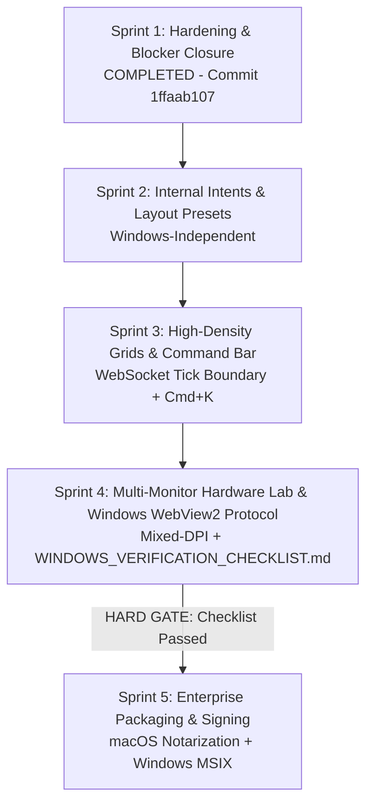

# Uisce Multi-Monitor Workstation — Architectural Pillars & Sprint Roadmap

This document serves as the authoritative blueprint and engineering schedule for the Uisce Universal Browser & Native Wails v3 Desktop Multi-Monitor Workstation.

---

## 1. Executive Status: Sprint 1 Completed & Verified

The Part 1 hardening requirements and review blockers (items A–D) are **complete, fully verified, and committed on `main`**:

- **A. Ghost Window Bug (Fixed & Verified)**:
  - **Go Desktop Engine**: In [`desk_window_manager.go`](file:///Users/eganpj/GitHub/uisce/desktop/desk_window_manager.go), added `GetOpenWindowIDs() []string` and `notifyWindowClosed(winID string)`. When an OS window closes via native controls or `CloseWindow`, Go emits a Wails event `desktop:window-closed` and executes DOM script `window.dispatchEvent(new CustomEvent('desktop:window-closed', { detail: { windowId } }))` across all remaining active windows.
  - **Frontend Auto-Cleanup**: In [`PlatformService.ts`](file:///Users/eganpj/GitHub/uisce/frontend/src/services/platform/PlatformService.ts), added a listener for `desktop:window-closed` and polling on `popup.closed` for browser popups, automatically removing closed windows from [`LayoutManager`](file:///Users/eganpj/GitHub/uisce/frontend/src/services/docking/LayoutManager.ts).
  - **Save-Time Reconciliation**: `handleSaveLayout()` invokes `reconcileDetachedWindows()` before serializing to localStorage.
  - **Dismiss Cleanup**: Clicking "Dismiss" on the restore prompt banner invokes `layoutManager.clearDetachedWindows()`, permanently purging un-restored windows.
  - **Test Evidence**:
    - **Live macOS Suite (Step 8)**: Native window closed; verified `desktop:window-closed` arrived at primary window, `HasWindow=false`, `ActiveCount=1`, `OpenIDs=[win_main]`.
    - **Playwright Multi-Screen Smoke (Step 7)**: Executed the complete repro sequence: popout → close via native X → save → reload → assert zero ghost re-spawn.
- **B. TypeScript Ratchet Audit**:
  - Pinned `node scripts/ts-ratchet.mjs` in CI ([`.github/workflows/workstation-ci.yml`](file:///Users/eganpj/GitHub/uisce/.github/workflows/workstation-ci.yml)).
  - Verified clean execution: `ratchet OK: 702 error blocks, 0 new (exit code 0)`.
- **C. Full Verification Chain**:
  - **Frontend Vitest**: **41 / 41 test files passed (181 tests, 0 failures)** (`npx vitest run`).
  - **Production Build**: **PASS** (`npm run build` generated `frontend/dist` in 22.20s).
  - **Playwright Multi-Screen Smoke**: **7 / 7 checks passed** (`npm run test:multiscreen`).
  - **Go Desktop Unit Tests**: **22 / 22 (standard)**, **23 / 23 (`-tags verify`) passed**.
  - **Live macOS Desktop Suite**: **8 / 8 passed** on real WKWebView windows (`npm run test:desktop`).
- **D. Git Landing**:
  - Committed to `main` as [`1ffaab107`](file:///Users/eganpj/GitHub/uisce): `fix(workstation): close ghost window bug, add live interactive sync verification & widen CI vitest`.

---

## 2. Five Pillars of Architectural Excellence

### Pillar 1: Internal Intent Resolution (FDC3-Compatible)
- **Concept**: Provide intent-based workflows (`fdc3.raiseIntent`) mapping trader actions to internal application views without an external app directory.
- **Target Intents & Handlers**:
  - `ViewInstrument`: Opens/focuses Market Depth or Security Master.
  - `ViewChart`: Opens/focuses Technical / Yield Curve charting.
  - `ViewOrders`: Opens/focuses OMS Order Blotter filtered by symbol.
  - `ViewAnalysis`: Opens/focuses AIPortfolioRebalancer or ScenarioAnalysisPro.
  - `ViewExecution`: Opens/focuses Execution Allocation drill-down.
- **Smart Routing & UI Ergonomics**:
  - If a single target view handles the intent, **route directly without showing a modal** (preserves speed and minimizes trader friction).
  - Surface an intent resolver modal **only when multiple possible target views exist**.
- **Minimal Result Contract**:
  - v1 uses a fire-and-forget model with visible acknowledgment and focus state in the target window.

### Pillar 2: High-Density Canvas Grids & Market Data Boundary
- **Concept**: Support 10,000+ streaming rows with sub-millisecond sorting, grouping, and virtualized scrolling in Dockview panels.
- **STRICT ARCHITECTURAL BOUNDARY — Market Data vs FDC3 Context**:
  - **Tick Data Never Goes Over FDC3**: High-frequency financial tick data, L2/L3 order book quotes, and execution fills MUST NEVER travel over the FDC3 context bus.
  - **Market Data Flow**: Ticks and order book updates flow per-window via direct WebSocket / gRPC-web connections from backend streaming services to each specific chart/grid view.
  - **FDC3 Context Flow**: The FDC3 bus carries **only user context** (e.g. which symbol or order is currently focused). Broadcasting ticks over FDC3 creates an IPC bottleneck that spams every window with every symbol's stream.
- **Loop-Guard Rule**:
  - Incoming context updates only mutate local state; user interactions trigger outgoing broadcasts.

### Pillar 3: Multi-Tenant PostgreSQL Presets & Travel Mode
- **Concept**: Roaming workspace configurations stored in PostgreSQL under tenant isolation.
- **Backend Architecture & Boundary**:
  - Restful profile endpoint `/api/user/preferences/workspace-layout` in `backend/internal/api`.
  - Frontend talks to API via standard HTTP client.
  - **Zero imports from `backend/` into `desktop/`** (preserves clean packaging and isolation).
- **Travel Mode (View-Time Dynamic Mode)**:
  - When an external monitor is disconnected, the system enters "Travel Mode" (collapsing auxiliary views into tabbed Dockview panels on the primary screen).
  - **Rule**: Travel Mode is applied as a **view-time dynamic layout transformation**, NOT a destructive mutation of the saved multi-monitor layout in the database or localStorage. When the user reconnects to their multi-monitor desk, the original layout restores seamlessly.

### Pillar 4: Unified Keyboard Command Bar & Global Shortcuts
- **Concept**: Rapid keyboard-first navigation for portfolio managers and traders.
- **Internal Command Bar (`Cmd+K` / `Ctrl+K`)**:
  - Instant searchable command palette for searching instruments, switching FDC3 color channels, opening views, and applying presets.
  - **Naming Discipline**: This is an **internal command bar**, NOT an "FDC3 App Directory".
- **Global vs Local Shortcuts**:
  - **Desktop Mode**: Global OS shortcuts (`Cmd+1`, `Cmd+2`) registered via Go AppKit/Win32 APIs to focus windows across physical displays even when another window is focused.
  - **Browser Mode**: Keyboard navigation operates within the active browser window/tab.

### Pillar 5: Institutional Packaging & Enterprise Distribution
- **Concept**: Enterprise-ready binaries with modern code signing and zero unnecessary OS permissions.
- **Security Audit Compliance**:
  - **Zero Camera/Microphone Entitlements**: Financial workstations have no business requesting audio/video recording permissions; omitting them removes audit red flags during institutional security diligence.
- **Packaging Targets**:
  - **macOS**: Signed and notarized Universal DMG / `.app` bundle via Apple Developer ID and `notarytool`.
  - **Windows**: **MSIX package** preferred over NSIS (modern signing, auto-update, enterprise Microsoft Intune & Group Policy deployment).
  - **Tooling Verification**: Pin and verify Wails v3 packaging commands per release before production builds.

---

## 3. Strict Naming Discipline

To ensure audit readiness and avoid diligence issues:
- **Use**: *"FDC3-compatible context model"*, *"FDC3-compatible context bus"*, *"FDC3-aligned data shapes"*.
- **Never Use**: *"FINOS FDC3 Certified"*, *"FDC3 App Directory"*, *"Full FDC3 Desktop Agent"*.
- Uisce provides a specialized, ultra-low-latency financial context interoperability bus inspired by the FINOS FDC3 standard, tailored for browser and Wails desktop multi-screen environments.

---

## 4. Multi-Sprint Implementation Roadmap

### Sprint 1: Part 1 Completion & Blocker Closure (COMPLETED)
- **Focus**: Close the 4 blockers from review; harden token exchange, URL hygiene, loop guards, and ghost window prevention.
- **Deliverables & Evidence**:
  - DeskWindowManager closing hooks + DOM event dispatching.
  - LayoutManager automatic unregistration on close + dismiss cleanup.
  - Full Vitest suite passing (41/41 suites, 181 tests).
  - Multi-screen Playwright smoke with cross-view sync and ghost window repro assertions (7/7 passed).
  - Live macOS verification suite (8/8 passed).
  - Commit `1ffaab107` landed on `main`.

### Sprint 2: Internal Intent Resolution & Workspace Presets (Next)
- **Focus**: Windows-independent functional elevation.
- **Scope**:
  - **FDC3-Compatible Intent Router**: Implement `fdc3Agent.raiseIntent(intent, context)`.
    - Direct routing when a single target view matches.
    - Resolver modal when multiple target views match.
  - **PostgreSQL Layout Profile Service**:
    - Backend migration & REST API: `GET/POST /api/user/preferences/workspace-layout`.
    - Roaming profile switcher in header toolbar.
  - **View-Time Travel Mode**:
    - Detect single-screen state; dynamically tab multi-monitor panels without mutating saved multi-screen layout state.

### Sprint 3: High-Density Grids & Command Bar
- **Focus**: High-throughput trading UI and keyboard ergonomics.
- **Scope**:
  - **Market Data Streaming Boundary**: Direct WebSocket market data feeds to blotter & depth grids; FDC3 context strictly limited to selection/focus.
  - **Internal Command Bar (`Cmd+K`)**: Fuzzy-search navigation for views, instruments, channels, and presets.
  - **Shortcut Engine**: Window focus shortcuts across displays in Go desktop mode; scoped within window in browser mode.

### Sprint 4: Multi-Monitor Hardware Lab, Mixed-DPI & Windows WebView2 Protocol
- **Focus**: Physical display testing, DPI scaling, and Windows verification.
- **Scope**:
  - **Physical Multi-Monitor Validation**: Verify window clamping, menu positioning, and DPI scaling across 1x, 2x, and mixed-DPI multi-monitor desks.
  - **Windows WebView2 6-Point Verification**:
    - Execute [`WINDOWS_VERIFICATION_CHECKLIST.md`](file:///Users/eganpj/GitHub/uisce/desktop/WINDOWS_VERIFICATION_CHECKLIST.md) on Windows 11 under WebView2 runtime.
    - Verify origin behavior (`http://wails.localhost`).
    - Verify `BroadcastChannel` cross-window delivery under shared user data folder.
    - Verify Go `WailsRelayTransport` fallback if `BroadcastChannel` is partitioned.

### Sprint 5: Enterprise Packaging, Installer Signing & Distribution
- **HARD GATE**: **Sprint 5 Windows packaging is blocked until Sprint 4 Windows WebView2 verification passes.**
- **Scope**:
  - **macOS Build**: Notarized, codesigned `.app` bundle and drag-and-drop DMG with zero camera/mic entitlements.
  - **Windows Build**: Signed **MSIX** enterprise installer with code-signing certificate (ready for Intune and Group Policy deployment).
  - **Automated Release Workflow**: Pinned Wails v3 packaging automation in GitHub Actions.
