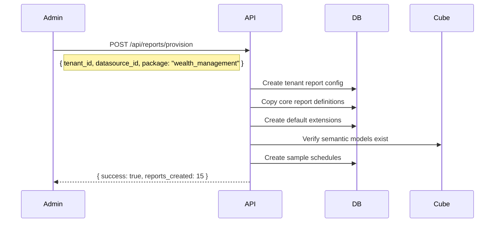

# Semantic Reporting Platform Architecture

## Overview

A metadata-first, config-over-code reporting platform that sits on top of the Cube.dev semantic layer. Reports are treated as **Business Objects** with lifecycle management, versioning, and tenant-scoped customization—following the Workday-style business object/business process approach.

## Core Principles

### 1. Metadata-First Design
Reports are defined entirely through configuration (JSON/YAML schemas), not code. This enables:
- Non-developers to create and modify reports
- Version control of report definitions
- Tenant-specific customizations without code changes
- AI-assisted report generation

### 2. Core/Extension Pattern
Like semantic models, reports have:
- **Core Report Definitions** - Base templates owned by platform
- **Extension Definitions** - Tenant/client customizations that override or extend core
- **Merged Runtime** - System merges core + extensions at render time

### 3. Business Object Model
Reports are first-class Business Objects with:
- Unique identifiers and lifecycle states
- Audit trails and change history
- Relationships to other business objects (Households, Portfolios, etc.)
- Workflow integration (approval, publishing)

### 4. Semantic Layer Integration
Reports query the Cube.dev semantic layer, not raw SQL:
- Reuse dimension/measure definitions from semantic models
- Automatic security filtering via tenant context
- Consistent business logic across all consumers

---

## Data Model

### Report Business Object Schema

```sql
-- Core report definition (platform-owned templates)
CREATE TABLE report_definitions (
    id UUID PRIMARY KEY DEFAULT gen_random_uuid(),
    tenant_id UUID REFERENCES tenants(id),
    tenant_datasource_id UUID REFERENCES tenant_datasources(id),
    
    -- Identity
    report_key VARCHAR(255) NOT NULL,           -- e.g., 'household_summary_report'
    display_name VARCHAR(255) NOT NULL,
    description TEXT,
    category VARCHAR(100),                       -- 'household', 'portfolio', 'compliance', etc.
    
    -- Type/Classification
    report_type VARCHAR(50) NOT NULL,           -- 'paginated', 'interactive', 'dashboard'
    output_formats JSONB DEFAULT '["pdf", "html", "excel"]',
    
    -- Definition (metadata-first)
    definition JSONB NOT NULL,                   -- Full report schema
    parameters_schema JSONB,                     -- Report parameters definition
    
    -- Semantic Layer Binding
    semantic_cube_id UUID,                       -- Optional direct cube binding
    semantic_query JSONB,                        -- Cube.js query template
    
    -- Versioning
    version INTEGER NOT NULL DEFAULT 1,
    is_current BOOLEAN NOT NULL DEFAULT TRUE,
    previous_version_id UUID REFERENCES report_definitions(id),
    
    -- Ownership
    is_core BOOLEAN NOT NULL DEFAULT FALSE,      -- Platform-owned vs tenant-owned
    base_report_id UUID REFERENCES report_definitions(id), -- For extensions
    
    -- Lifecycle
    status VARCHAR(50) DEFAULT 'draft',          -- 'draft', 'published', 'deprecated'
    published_at TIMESTAMPTZ,
    published_by UUID,
    
    -- Audit
    created_at TIMESTAMPTZ DEFAULT NOW(),
    created_by UUID,
    updated_at TIMESTAMPTZ DEFAULT NOW(),
    updated_by UUID,
    
    UNIQUE(tenant_id, tenant_datasource_id, report_key, version)
);

-- Report extension layer (tenant customizations)
CREATE TABLE report_extensions (
    id UUID PRIMARY KEY DEFAULT gen_random_uuid(),
    tenant_id UUID NOT NULL REFERENCES tenants(id),
    tenant_datasource_id UUID NOT NULL REFERENCES tenant_datasources(id),
    
    -- Link to core
    base_report_id UUID NOT NULL REFERENCES report_definitions(id),
    
    -- Extension definition
    extension_key VARCHAR(255) NOT NULL,
    extension_definition JSONB NOT NULL,         -- Overrides/additions
    
    -- What's customized
    overrides JSONB,                             -- Field-level overrides
    additions JSONB,                             -- New sections/fields
    removals JSONB,                              -- Sections to hide
    
    -- Parameter overrides
    parameter_defaults JSONB,
    
    -- Versioning
    version INTEGER NOT NULL DEFAULT 1,
    is_current BOOLEAN NOT NULL DEFAULT TRUE,
    core_version_target INTEGER,                 -- Which core version this extends
    
    -- Lifecycle
    status VARCHAR(50) DEFAULT 'draft',
    
    -- Audit
    created_at TIMESTAMPTZ DEFAULT NOW(),
    created_by UUID,
    updated_at TIMESTAMPTZ DEFAULT NOW(),
    updated_by UUID,
    
    UNIQUE(tenant_id, tenant_datasource_id, extension_key, version)
);

-- Report instances (generated reports)
CREATE TABLE report_instances (
    id UUID PRIMARY KEY DEFAULT gen_random_uuid(),
    tenant_id UUID NOT NULL REFERENCES tenants(id),
    tenant_datasource_id UUID NOT NULL REFERENCES tenant_datasources(id),
    
    -- Source definition
    report_definition_id UUID NOT NULL REFERENCES report_definitions(id),
    report_extension_id UUID REFERENCES report_extensions(id),
    
    -- Context (what entity the report is for)
    context_type VARCHAR(100),                   -- 'household', 'portfolio', 'client', etc.
    context_id UUID,
    context_name VARCHAR(255),
    
    -- Parameters used
    parameters JSONB,
    
    -- Generated content
    output_format VARCHAR(50) NOT NULL,          -- 'pdf', 'html', 'excel'
    output_data BYTEA,                           -- Binary content
    output_url VARCHAR(500),                     -- S3/blob URL
    output_metadata JSONB,                       -- Page count, size, etc.
    
    -- Lifecycle
    status VARCHAR(50) DEFAULT 'generating',     -- 'generating', 'completed', 'failed', 'expired'
    error_message TEXT,
    
    -- Timing
    requested_at TIMESTAMPTZ DEFAULT NOW(),
    started_at TIMESTAMPTZ,
    completed_at TIMESTAMPTZ,
    expires_at TIMESTAMPTZ,
    
    -- Requester
    requested_by UUID,
    
    -- Audit
    created_at TIMESTAMPTZ DEFAULT NOW()
);

-- Report schedules (for recurring reports)
CREATE TABLE report_schedules (
    id UUID PRIMARY KEY DEFAULT gen_random_uuid(),
    tenant_id UUID NOT NULL REFERENCES tenants(id),
    tenant_datasource_id UUID NOT NULL REFERENCES tenant_datasources(id),
    
    report_definition_id UUID NOT NULL REFERENCES report_definitions(id),
    report_extension_id UUID REFERENCES report_extensions(id),
    
    -- Schedule
    schedule_name VARCHAR(255) NOT NULL,
    cron_expression VARCHAR(100) NOT NULL,
    timezone VARCHAR(50) DEFAULT 'UTC',
    
    -- Parameters template
    parameters_template JSONB,
    
    -- Context (dynamic or fixed)
    context_query JSONB,                         -- Query to get contexts to run for
    
    -- Output
    output_formats JSONB DEFAULT '["pdf"]',
    
    -- Delivery
    delivery_config JSONB,                       -- Email, S3, webhook, etc.
    
    -- State
    is_active BOOLEAN DEFAULT TRUE,
    last_run_at TIMESTAMPTZ,
    next_run_at TIMESTAMPTZ,
    
    -- Audit
    created_at TIMESTAMPTZ DEFAULT NOW(),
    created_by UUID,
    updated_at TIMESTAMPTZ DEFAULT NOW()
);
```

---

## Report Definition Schema (JSON)

### Core Report Definition Structure

```json
{
  "$schema": "https://semlayer.io/schemas/report-definition-v1.json",
  "version": "1.0.0",
  
  "metadata": {
    "key": "household_performance_report",
    "displayName": "Household Performance Report",
    "description": "Comprehensive performance analysis for household entities",
    "category": "household",
    "tags": ["performance", "household", "quarterly"]
  },
  
  "parameters": [
    {
      "name": "household_id",
      "type": "uuid",
      "label": "Household",
      "required": true,
      "dataSource": {
        "cube": "households",
        "dimension": "id",
        "displayDimension": "name"
      }
    },
    {
      "name": "date_range",
      "type": "dateRange",
      "label": "Reporting Period",
      "default": "last_quarter"
    },
    {
      "name": "include_benchmarks",
      "type": "boolean",
      "label": "Include Benchmarks",
      "default": true
    }
  ],
  
  "dataBindings": {
    "primary": {
      "cube": "household_performance",
      "measures": ["total_value", "total_return", "ytd_return", "inception_return"],
      "dimensions": ["household_id", "household_name", "account_type"],
      "filters": [
        { "dimension": "household_id", "operator": "equals", "parameter": "household_id" }
      ],
      "timeDimension": {
        "dimension": "as_of_date",
        "granularity": "month",
        "dateRange": { "parameter": "date_range" }
      }
    },
    "holdings": {
      "cube": "household_holdings",
      "measures": ["market_value", "weight", "gain_loss"],
      "dimensions": ["security_name", "asset_class", "sector"],
      "filters": [
        { "dimension": "household_id", "operator": "equals", "parameter": "household_id" }
      ]
    },
    "benchmarks": {
      "cube": "benchmark_returns",
      "measures": ["total_return", "ytd_return"],
      "dimensions": ["benchmark_name"],
      "conditional": { "parameter": "include_benchmarks", "equals": true }
    }
  },
  
  "layout": {
    "pageSettings": {
      "size": "letter",
      "orientation": "portrait",
      "margins": { "top": 72, "right": 72, "bottom": 72, "left": 72 }
    },
    
    "header": {
      "height": 100,
      "elements": [
        { "type": "image", "src": "{{tenant.logo_url}}", "position": { "x": 0, "y": 0 }, "size": { "width": 150, "height": 60 } },
        { "type": "text", "content": "{{parameters.household_name}}", "style": { "fontSize": 24, "fontWeight": "bold" }, "position": { "x": 200, "y": 10 } },
        { "type": "text", "content": "Performance Report", "style": { "fontSize": 16 }, "position": { "x": 200, "y": 40 } },
        { "type": "text", "content": "As of {{parameters.date_range.end | date:'MMMM d, yyyy'}}", "position": { "x": 200, "y": 60 } }
      ]
    },
    
    "footer": {
      "height": 40,
      "elements": [
        { "type": "text", "content": "Confidential - {{tenant.name}}", "position": { "x": 0, "y": 10 } },
        { "type": "pageNumber", "format": "Page {current} of {total}", "position": { "x": 450, "y": 10 } }
      ]
    },
    
    "body": {
      "sections": [
        {
          "id": "summary",
          "type": "summary",
          "title": "Performance Summary",
          "dataBinding": "primary",
          "elements": [
            {
              "type": "kpiCard",
              "title": "Total Value",
              "value": "{{data.total_value | currency}}",
              "change": "{{data.total_return | percent}}",
              "changeType": "{{data.total_return >= 0 ? 'positive' : 'negative'}}"
            },
            {
              "type": "kpiCard",
              "title": "YTD Return",
              "value": "{{data.ytd_return | percent}}",
              "benchmark": "{{benchmarks.ytd_return | percent}}",
              "benchmarkLabel": "S&P 500"
            }
          ]
        },
        {
          "id": "performance_chart",
          "type": "chart",
          "title": "Performance Over Time",
          "dataBinding": "primary",
          "chartType": "line",
          "config": {
            "xAxis": { "dimension": "as_of_date", "label": "Date" },
            "yAxis": { "measure": "total_value", "label": "Portfolio Value", "format": "currency" },
            "series": [
              { "measure": "total_value", "label": "Portfolio" },
              { "dataBinding": "benchmarks", "measure": "total_return", "label": "Benchmark", "conditional": "include_benchmarks" }
            ]
          }
        },
        {
          "id": "holdings_table",
          "type": "table",
          "title": "Holdings Detail",
          "dataBinding": "holdings",
          "pageBreakBefore": true,
          "columns": [
            { "dimension": "security_name", "label": "Security", "width": 200 },
            { "dimension": "asset_class", "label": "Asset Class", "width": 100 },
            { "measure": "market_value", "label": "Market Value", "format": "currency", "width": 120 },
            { "measure": "weight", "label": "Weight", "format": "percent", "width": 80 },
            { "measure": "gain_loss", "label": "Gain/Loss", "format": "currency", "conditionalStyle": "gainLoss" }
          ],
          "groupBy": ["asset_class"],
          "subtotals": true,
          "grandTotal": true
        }
      ]
    }
  },
  
  "conditionalStyles": {
    "gainLoss": {
      "positive": { "color": "#16a34a" },
      "negative": { "color": "#dc2626" }
    }
  },
  
  "drillDown": {
    "holdings_table": {
      "targetReport": "security_detail_report",
      "parameters": {
        "security_id": "{{row.security_id}}"
      }
    }
  },
  
  "exports": {
    "pdf": { "enabled": true, "watermark": "{{tenant.watermark}}" },
    "excel": { "enabled": true, "includeData": true },
    "html": { "enabled": true, "interactive": true }
  }
}
```

### Extension Definition Structure

```json
{
  "$schema": "https://semlayer.io/schemas/report-extension-v1.json",
  "version": "1.0.0",
  
  "metadata": {
    "extensionKey": "acme_household_performance",
    "baseReportKey": "household_performance_report",
    "baseVersion": 1,
    "displayName": "ACME Household Performance Report",
    "description": "Customized for ACME Corp requirements"
  },
  
  "overrides": {
    "layout.header.elements[0].src": "https://acme.com/logo.png",
    "layout.body.sections[0].elements[0].title": "Portfolio Value",
    "parameters[2].default": false
  },
  
  "additions": {
    "layout.body.sections": [
      {
        "id": "acme_risk_metrics",
        "type": "table",
        "title": "Risk Metrics",
        "insertAfter": "summary",
        "dataBinding": {
          "cube": "risk_metrics",
          "measures": ["var_95", "sharpe_ratio", "max_drawdown"],
          "filters": [
            { "dimension": "household_id", "operator": "equals", "parameter": "household_id" }
          ]
        },
        "columns": [
          { "measure": "var_95", "label": "VaR (95%)", "format": "currency" },
          { "measure": "sharpe_ratio", "label": "Sharpe Ratio", "format": "decimal:2" },
          { "measure": "max_drawdown", "label": "Max Drawdown", "format": "percent" }
        ]
      }
    ],
    "parameters": [
      {
        "name": "risk_model",
        "type": "select",
        "label": "Risk Model",
        "options": ["historical", "monte_carlo", "parametric"],
        "default": "historical"
      }
    ]
  },
  
  "removals": {
    "layout.body.sections": ["performance_chart"]
  },
  
  "parameterDefaults": {
    "include_benchmarks": false,
    "date_range": "last_month"
  }
}
```

---

## Go Backend Services

### Package Structure

```
backend/internal/reporting/
├── model.go                 # Data structures
├── schema.go                # JSON schema validation
├── repository.go            # Database operations
├── service.go               # Business logic
├── merger.go                # Core/extension merging
├── renderer.go              # Report rendering engine
├── cube_client.go           # Cube.js integration
├── pdf_generator.go         # PDF output
├── excel_generator.go       # Excel output
├── html_generator.go        # HTML output
├── scheduler.go             # Report scheduling
├── handler.go               # HTTP handlers
└── provisioner.go           # Tenant provisioning
```

### API Endpoints

```
POST   /api/reports/definitions              # Create report definition
GET    /api/reports/definitions              # List definitions
GET    /api/reports/definitions/:id          # Get definition
PUT    /api/reports/definitions/:id          # Update definition
DELETE /api/reports/definitions/:id          # Delete definition

POST   /api/reports/extensions               # Create extension
GET    /api/reports/extensions               # List extensions
GET    /api/reports/extensions/:id           # Get extension
PUT    /api/reports/extensions/:id           # Update extension

POST   /api/reports/render                   # Render report (sync)
POST   /api/reports/render/async             # Queue report generation
GET    /api/reports/instances/:id            # Get generated report
GET    /api/reports/instances/:id/download   # Download report

POST   /api/reports/schedules                # Create schedule
GET    /api/reports/schedules                # List schedules
PUT    /api/reports/schedules/:id            # Update schedule
DELETE /api/reports/schedules/:id            # Delete schedule

POST   /api/reports/provision                # One-click tenant provisioning
```

---

## Tenant Provisioning Flow

### One-Click Setup



### Provisioning Packages

Pre-configured report bundles by industry:
- `wealth_management` - Household, performance, allocation reports
- `asset_management` - Portfolio, fund, investor reports
- `banking` - Account, transaction, compliance reports
- `insurance` - Policy, claims, actuarial reports

---

## React Frontend Components

### Component Hierarchy

```
src/components/reporting/
├── ReportCatalog/
│   ├── ReportCatalogPage.tsx        # Browse available reports
│   ├── ReportCard.tsx               # Report preview card
│   └── ReportFilters.tsx            # Category/tag filters
├── ReportBuilder/
│   ├── ReportBuilderPage.tsx        # SSRS-style designer
│   ├── DesignCanvas.tsx             # Drag-drop layout
│   ├── ElementPalette.tsx           # Available elements
│   ├── PropertiesPanel.tsx          # Element properties
│   ├── DataBindingPanel.tsx         # Cube.js query builder
│   └── PreviewPane.tsx              # Live preview
├── ReportViewer/
│   ├── ReportViewerPage.tsx         # View/download reports
│   ├── ParameterForm.tsx            # Parameter input
│   ├── ReportPreview.tsx            # Paginated preview
│   └── ExportOptions.tsx            # Export format selection
├── ExtensionEditor/
│   ├── ExtensionEditorPage.tsx      # Create/edit extensions
│   ├── OverrideEditor.tsx           # Field-level overrides
│   ├── AdditionEditor.tsx           # Add new sections
│   └── DiffViewer.tsx               # Core vs extension diff
├── Scheduling/
│   ├── ScheduleManager.tsx          # Manage schedules
│   ├── ScheduleForm.tsx             # Create/edit schedule
│   └── DeliveryConfig.tsx           # Delivery options
└── Admin/
    ├── TenantProvisioning.tsx       # One-click setup
    └── ReportMetrics.tsx            # Usage analytics
```

---

## Cube.js Integration

### Query Generation

The report renderer generates Cube.js queries from data bindings:

```typescript
interface CubeQuery {
  measures: string[];
  dimensions: string[];
  filters: CubeFilter[];
  timeDimensions?: CubeTimeDimension[];
  order?: Record<string, 'asc' | 'desc'>;
  limit?: number;
}

function generateCubeQuery(dataBinding: DataBinding, parameters: Record<string, any>): CubeQuery {
  const query: CubeQuery = {
    measures: dataBinding.measures.map(m => `${dataBinding.cube}.${m}`),
    dimensions: dataBinding.dimensions.map(d => `${dataBinding.cube}.${d}`),
    filters: dataBinding.filters.map(f => ({
      dimension: `${dataBinding.cube}.${f.dimension}`,
      operator: f.operator,
      values: [resolveParameter(f.parameter, parameters)]
    }))
  };
  
  if (dataBinding.timeDimension) {
    query.timeDimensions = [{
      dimension: `${dataBinding.cube}.${dataBinding.timeDimension.dimension}`,
      granularity: dataBinding.timeDimension.granularity,
      dateRange: resolveParameter(dataBinding.timeDimension.dateRange.parameter, parameters)
    }];
  }
  
  return query;
}
```

### Security Integration

All Cube.js queries automatically include tenant filtering:

```go
func (c *CubeClient) ExecuteQuery(ctx context.Context, query CubeQuery, tenantID, datasourceID uuid.UUID) (*CubeResult, error) {
    // Add tenant filter automatically
    query.Filters = append(query.Filters, CubeFilter{
        Dimension: "tenant_id",
        Operator:  "equals",
        Values:    []string{tenantID.String()},
    })
    
    // Execute via Cube.js API
    return c.execute(ctx, query)
}
```

---

## Implementation Phases

### Phase 1: Foundation (Week 1-2)
- [ ] Database schema migration
- [ ] Core Go models and repository
- [ ] JSON schema validation
- [ ] Basic CRUD API endpoints

### Phase 2: Rendering Engine (Week 3-4)
- [ ] Cube.js client integration
- [ ] Core/extension merger
- [ ] PDF generator (using go-pdf or similar)
- [ ] HTML renderer

### Phase 3: Frontend (Week 5-6)
- [ ] Report catalog page
- [ ] Parameter form component
- [ ] Report viewer with pagination
- [ ] Extension editor

### Phase 4: Advanced Features (Week 7-8)
- [ ] Report builder (SSRS-style designer)
- [ ] Scheduling system
- [ ] Email/webhook delivery
- [ ] Tenant provisioning

---

## File Locations

```
backend/
├── internal/
│   └── reporting/
│       ├── model.go
│       ├── schema.go
│       ├── repository.go
│       ├── service.go
│       ├── merger.go
│       ├── renderer.go
│       ├── cube_client.go
│       ├── pdf_generator.go
│       ├── handler.go
│       └── provisioner.go
├── migrations/
│   └── 20251126_create_reporting_tables.sql

frontend/
├── src/
│   └── features/
│       └── reporting/
│           ├── pages/
│           │   ├── ReportCatalogPage.tsx
│           │   ├── ReportBuilderPage.tsx
│           │   ├── ReportViewerPage.tsx
│           │   └── ExtensionEditorPage.tsx
│           ├── components/
│           │   ├── ReportCard.tsx
│           │   ├── ParameterForm.tsx
│           │   ├── ReportPreview.tsx
│           │   └── DataBindingPanel.tsx
│           ├── hooks/
│           │   ├── useReportDefinitions.ts
│           │   ├── useReportRenderer.ts
│           │   └── useCubeQuery.ts
│           └── types/
│               └── reporting.ts

schema/
└── reporting/
    ├── report-definition-v1.json
    └── report-extension-v1.json
```
