# Unify Cubes with the Existing Page Designer (No Second Designer)

| Field | Value |
|-------|--------|
| **Status** | **Approved** — implementation starts at PR0 (rev 5) |
| **Author** | Architecture (design-doc-writer) |
| **Date** | 2026-10-05 |
| **Related** | Uisce cubes program (CUBE-0 → CUBE-2.5 on `feat/cube-tables-phase0`); CUBE-3.1 / CUBE-3.3 sketches; Page Studio app model + blueprints |
| **Decision type** | Product + architecture — plan only (no implementation in this doc) |

---

## Overview

Uisce already has **one live Page Designer** (`/page-studio` → `frontend/src/pages/page-studio/`) that rebuilds portal admin surfaces from a page model via **blueprints**, `STUDIO_ROUTES`, `RuntimePage`, App widgets, and (where needed) small DomainComponents. Cubes today are authored on a **specialized coded shell** (`/build/cubes*`, `frontend/src/features/cubes/`) while analytical consumption already converges on a shared **`QuerySubject`** (`business_object` | `cube`) in Query Builder (CUBE-1.6).

**End state:** cubes fit the same portal model as Schedules and Data Pipelines — cube **catalog/ops** and a **composed designer host page** are Page Designer blueprints; federation (and similarly specialized) chrome is a **small named DomainComponent**, not a full-viewport shell; cube **results** are ordinary page tiles that pin `cubeId` + `contractVersion`.

**Phase 1 delivery (mandatory first ship):** Alternative 1 as a *slice* — keep coded CubeDesigner/catalog unchanged, ship cube-capable page tiles once saved-query (or explicit execute) plumbing carries `QuerySubject` through to `CubeRouter.RoutePinned`. Hybrid admin cutover follows; Alternative 1 is **rejected as the permanent end state**.

**Binding product axiom:** exactly one Page Designer product surface. No cube-only Page Designer, no revival of `frontend/src/components/pagestudio/`, no second query/report shell for cubes, and **no full-page `cubes.Designer` DomainComponent** that rehosts `CubeDesignerPage` chrome inside a thin studio wrapper.

---

## Background & Motivation

### Current state (verified in repo)

**Live Page Designer (extend this only)**

| Concern | Path / mechanism |
|---------|------------------|
| Authoring routes | `/page-studio`, `/page-studio/:id` → `PageStudioListPage`, `PageStudioDetailsPage`, `PageEditor`, `LayoutCanvas`, `ComponentPalette`, `DataBindingsPanel` |
| Model | `frontend/src/types/pageStudio.ts` — `CorePageDefinition`, layout tree / grid, `filterBar`, `app?: PageAppModel`, `pageKind`, `dataSources`, gold-copy `isCore` / customization |
| Blueprints | `frontend/src/pages/page-studio/app/blueprints/` — `PageBlueprint` with `build(): Omit<CorePageDefinition,...>` |
| Portal mount | `STUDIO_ROUTES` in `studioRoutes.ts` → `AppRoutes.tsx` `{STUDIO_ROUTES.map(...)}` → `PageContent` by slug |
| Runtime | `app/RuntimePage.tsx`, `AppRuntime.tsx`, widgets (`TileWidget`, `KpiTileWidget`, `SavedQueryWidget`, `SlicerWidget`, App widgets, `DomainComponent`) |
| Domain escape hatch | `frontend/src/studio-core/components/registry.ts` — specialized hand-built React with declared inputs/events |

**Correct pipelines / DomainComponent precedent (do not mis-cite)**

| Surface | Actual pattern in repo |
|---------|------------------------|
| Data pipelines **list** | Blueprint `DataGrid` + registered operations (`dataPipelines.ts` list page) |
| Data pipelines **editor** | Blueprint composed of **generic App widgets**: `Canvas`, `Form`, `Chat`, `DataGrid`, operations — **not** a `dataPipelines.Editor` DomainComponent (parity tests assert absence) |
| MDM source scoring specialized viz | **DomainComponents** (`mdmScoring.*` in `sourceScoring.ts`) for radar/optimizer-class UI |
| Implication for cubes | **Catalog ≈ pipelines list.** **Overview/dims/metrics/grains/versions ≈ Form + operations** (pipelines-editor style composition). **FederationEditor (and similar dense viz) ≈ small MDM-style DomainComponents.** Never wrap the whole designer as one DomainComponent. |

**Persistence reality**

- `types/pageStudio.ts` still carries a **ZERO-PAGE WINDOW** comment claiming `/api/page-studio` has no Go implementation — **stale**.
- Live handler: `backend/internal/handlers/page_studio_handler.go` (CRUD, gold-copy, fragments, templates, export/import), wired from `api.go`.
- `PageContent` requires a persisted/gold page by slug; missing → *"not in this environment yet… From blueprint."*
- **Repo seed precedent:** SQL migrations insert core pages for gold tenant, e.g. `20261207_001_seed_system_lakehouse_page.up.sql`, `20261118_003_seed_mdm_source_scoring_page.up.sql`, with blueprint↔seed parity vitests. Cube portal pages follow this pattern — not manual-only seeding.

**Orphan / do-not-revive**

- `frontend/src/components/pagestudio/` — tests only; `HANDOFF_BI_WORK.md`.
- Abandoned worktree Page Designers — do not merge.
- `/page-designer` → `/page-studio`.

**Cubes authoring today**

- Menu: Build → Models → Cubes → `/build/cubes`, `/build/cubes/new`, `/build/cubes/:cubeId` (`MainNavigation.tsx`, `AppRoutes.tsx` lines ~278–280, **before** `STUDIO_ROUTES.map`).
- FE: `CubesCatalogPage`, `CubeDesignerPage` (~783 lines, tabs: overview, dimensions, metrics, grains, federation, materialization, versions), `FederationEditor`, `cubeDefinitionApi`.
- BE: `CubeHandler` — list/create/get/patch/validate/versions/deploy/refresh; gold-core; federation through CUBE-2.5.

**Analytical subject already shared**

- `frontend/src/features/analytical-subject/` — `QuerySubject`, `SubjectPicker`, field catalogs, `RouteBadge`.
- Query Builder consumes it (CUBE-1.6). Report Builder pin + migrate still pending (CUBE-3.3).

```ts
type QuerySubject =
  | { kind: 'business_object'; boId: string; bindingId: string; relatedBoIds?: string[] }
  | { kind: 'cube'; cubeId: string; contractVersion: number | 'latest' };
```

**Critical gap — page tiles cannot pin cubes today**

- Ad-hoc `/api/query/execute` honors `QueryContext.Subject` and `CubeRouter.RoutePinned` (CUBE-1.6).
- Page Studio analytical widgets that matter (`SavedQueryWidget`, grid paths) call **`runSavedQuery`**, not `/api/query/execute`.
- Backend `savedQueryDef` in `backend/internal/querybuilder/saved_query_handler.go` builds:

```go
Context: boresolver.QueryContext{
  BOID: sq.BOID, BindingID: sq.BindingID, TenantID: tenantID, RelatedBOIDs: sq.RelatedBOIDs,
}
```

  — **no `Subject`**. Saved-query FE/API types lack cube subject fields. Adding FE pickers alone still executes as BO queries. **Consume requires backend (+ FE) saved-query subject plumbing** (or an alternate direct-execute widget path). Claiming “no backend changes” for consume is false.

**Hard product locks (cubes program)**

- One analytical shell: QB + Report Builder share subject picker.
- Consumers pin `cubeId` + `contractVersion`; legacy names migrate once and fail closed.
- Federation on semantic terms + bindings.
- Dual-tier materialize proven (CUBE-2.5).

### Pain points

1. Two authoring homes for portal work (studio pages vs coded cubes).
2. Cube results not first-class page tiles; execute path drops subject.
3. Risk of a second designer (historical BI orphans).
4. CUBE-3.1 / 3.3 underspecify portal admin vs DomainComponent vs coded shell.

---

## Goals & Non-Goals

### Goals

1. **Single designer axiom** — One Page Designer (`/page-studio`). Designer host is a **composed** page (tabs, Form, ActionButton, ops, small DomainComponents) — not a rehosted coded shell.
2. **Cube admin via portal page model** — Catalog and designer host as blueprints + `STUDIO_ROUTES` after seed; rich federation as named DomainComponents.
3. **Cube results on portal pages** — Standalone and mixed BO+cube tiles; subject pinned through the real execute path; fail closed on mismatch / unresolved legacy names.
4. **Portal completeness boundary** — Explicit coded vs blueprint surfaces.
5. **Phased delivery** — Phase 1 = Alternative 1 slice (tiles + coded admin). Then catalog blueprint + route cutover. Then composed designer host. Report Builder pin parallelizable.
6. **Non-revival** of orphan `components/pagestudio`.

### Non-Goals

- Rewriting FederationEditor as pure generic Form fields.
- A single full-page `cubes.Designer` DomainComponent / iframe of `CubeDesignerPage`.
- Second Query Builder or Report Builder for cubes.
- Client-side SQL for cube tiles.
- Retention email / Infisical; extract-N→staging Temporal (deferred).
- Turning Query Builder into a Page Blueprint.
- Long-term dual-write of cube name strings.

---

## Proposed Design

### Recommendation: **Hybrid end state; Alternative 1 as Phase 1 ship slice**

| Alternative | Role |
|-------------|------|
| 1. Keep CubeDesigner coded; add cube-result widgets + QuerySubject | **Accepted as Phase 1 delivery**; **rejected as permanent end state** |
| 2. Rebuild entire designer as generic widgets only | Rejected — FederationEditor is domain-grade |
| 3. **Hybrid (end-state recommendation)** | Catalog + composed designer host as blueprints; **small** DomainComponents for federation (and similar); results as subject-pinned tiles |
| 4. iframe / full-page DomainComponent of CubeDesigner | **Banned** — second shell in practice |

```mermaid
flowchart TB
  subgraph OneDesigner["One Page Designer product"]
    PS["/page-studio PageEditor"]
    BP["Blueprints: cubes-catalog, cube-designer host"]
    SR["STUDIO_ROUTES → PageContent"]
    PS --> BP --> SR
  end

  subgraph Composed["Designer host = composed page model"]
    TAB["Page tabs: overview / dims / metrics / grains / federation / materialize / versions"]
    FORM["Form + ActionButton + registered cubes.* ops"]
    DC["Small DomainComponents only: cubes.FederationEditor, optional materialize status"]
    TAB --> FORM
    TAB --> DC
  end

  subgraph Consume["Portal consumption"]
    SQ["Saved query with persisted subject"]
    TILE["SavedQueryWidget / chart / slicer"]
    RP["savedQueryDef → Context.Subject → RoutePinned"]
    TILE --> SQ --> RP
  end

  SR --> Composed
  PS -->|authors| TILE
```



### A. Single designer axiom

Authors use:

1. **Page Designer** for portal pages (including cube catalog, composed designer host, dashboards), or
2. **Query Builder / Report Builder** coded shells with shared `SubjectPicker` — not cube-only forks.

**Non-negotiable:** PR that lands designer cutover must compose the host from page-model widgets + **named small DomainComponents**. Ban `DomainComponent` id `cubes.Designer` (or equivalent) that mounts substantially all of `CubeDesignerPage`.

### B. Cube admin via Page Designer

#### B.1 Blueprints

| Blueprint id | Slug | Role |
|--------------|------|------|
| `cubes-catalog` | `cubes-catalog` | List/filter (scope), open designer, deploy/refresh via operations — **pipelines list pattern** |
| `cube-designer` | `cube-designer` | **Composed** host for one cube; tabs in page model; per-tab Form/ops vs small DomainComponents (see §B.5) |

#### B.2 Studio routes (decided)

Keep existing Build → Cubes menu URLs. `STUDIO_ROUTES` hosts blueprints at those paths (no user relearning). Designer host binds `{{route.id}}` via param name **`:id`**.

```ts
{ path: 'build/cubes', slug: 'cubes-catalog' },
{ path: 'build/cubes/new', slug: 'cube-designer' }, // absent/empty route.id → create mode
{ path: 'build/cubes/:id', slug: 'cube-designer' },
```

**Create flow (decided):** `/build/cubes/new` opens the designer host with no id (`is_new`); after first successful save, navigate to `/build/cubes/{{result.id}}` (URL shows the cube UUID; route param remains `:id` for `{{route.id}}`). Optional one-release shim: coded `/build/cubes/:cubeId` → same studio page if old links exist.

#### B.3 Operations (`features/cubes/studio.ts` + registry)

| Operation | Maps to |
|-----------|---------|
| `cubes.list` | `GET /api/cubes` |
| `cubes.get` | `GET /api/cubes/{id}` |
| `cubes.create` / `cubes.patch` | POST/PATCH |
| `cubes.validate` | `POST .../validate` (+ optional key samples) |
| `cubes.deploy` / `cubes.refresh` | existing materialize starts |
| `cubes.metrics` | `GET /api/cubes/metrics?boId=` |
| `cubes.editorStart` (recommended) | Load draft shape + `is_new` like `dataPipelines` load / `schedules.editorStart` |
| `cubes.businessObjects` | List BO options for FederationEditor `bos` input (wrap `listBusinessObjects`) |

#### B.4 AppRoutes cutover (explicit — no vague dual-mount)

**Today** (`AppRoutes.tsx`): coded routes at `build/cubes`, `build/cubes/new`, `build/cubes/:cubeId` are registered **before** `{STUDIO_ROUTES.map(...)}`. Duplicate paths must never both be registered.

**Phased mechanics:**

| Phase | Catalog `/build/cubes` | Designer `/build/cubes/new` + `/build/cubes/:id` |
|-------|------------------------|--------------------------------------------------|
| Phase 1 (consume) | **Coded** `CubesCatalogPage` | **Coded** `CubeDesignerPage` (`:cubeId` today) |
| Phase 2 (PR5) | **Remove** coded catalog route; add `{ path: 'build/cubes', slug: 'cubes-catalog' }` only | Still coded — **do not** add designer paths to `STUDIO_ROUTES` yet |
| Phase 3 (PR6) | Unchanged studio | **Remove** coded `new` + `:cubeId` routes; add `build/cubes/new` + `build/cubes/:id` to `STUDIO_ROUTES`; optional `<Navigate from=":cubeId">` shim one release |

**Capability gate (no LaunchDarkly precedent in AppRoutes):** use a small wrapper, e.g. env `VITE_CUBES_STUDIO_CATALOG=1` and/or tenant capability checked once in `CubesStudioCatalogRoute`:

```tsx
// Illustrative — not a new product flag system
function CubesStudioCatalogRoute() {
  if (!cubesStudioCatalogEnabled()) {
    return <CubesCatalogPage />; // or Navigate to keep one URL
  }
  return <StudioPageContent slug="cubes-catalog" />;
}
```

Preferred for Phase 2: **replace** the single coded catalog `<Route>` with either the wrapper or direct `StudioPageContent` after seed receipt — do not leave two Route entries for the same path.

#### B.5 Designer host decomposition (implementable contract)

**Ban:** one DomainComponent that is “the designer.”

**Page variables (app model):**

| Variable | Purpose |
|----------|---------|
| `cubeId` | From `{{route.id}}` when editing; empty when create |
| `draft` | Working cube draft object (name, boId, dimensions, metricIds, grains, materialization, federation) |
| `dirty` | Unsaved changes |
| `tab` | Active tab id (`app.tabVariable`) |
| `federationKeySamples` | Session-only orphan-gate fixtures (not persisted on `cube_definition`; same as today’s designer local state) |
| `validation` | Last validate response |
| `info` / `error` | Banner strings |

**Tab → hosting matrix:**

| Tab | Hosting | Notes |
|-----|---------|-------|
| overview | `Form` fields + `cubes.patch` / `cubes.create` | name, description, boId, is_core display |
| dimensions | `Form` / chips + ops | term multi-select from BO terms query |
| metrics | `Form` / DataGrid + `cubes.metrics` | metric id multi-select |
| grains | `Form` / structured editor + ops | grain arrays; prefer Form/ops before a DomainComponent |
| federation | **`DomainComponent` `cubes.FederationEditor`** | inputs: `primaryBoId`, `bos`, `federation`, `keySamples`; events: `onChange`, `onKeySamplesChange` |
| materialization | Form + optional small `cubes.MaterializeStatus` DomainComponent | strategy fields + deploy/refresh ActionButtons |
| versions | DataGrid + ops | list versions when API exposed; read-only history |

**Toolbar (page chrome, not DomainComponent):** ActionButtons → `cubes.validate` (pass `{{vars.draft}}` + `{{vars.federationKeySamples}}`), `cubes.deploy`, `cubes.refresh`, Save → create/patch.

**`cubes.FederationEditor` contract (must match live `FederationEditor` props):**

Live props (`FederationEditor.tsx`): `primaryBoId`, `bos: BusinessObjectOption[]`, `federation`, `keySamples`, `onChange`, `onKeySamplesChange`.

```ts
// DomainComponentDef — inputs/events map 1:1 to live props
{
  id: 'cubes.FederationEditor',
  domain: 'cubes',
  inputs: [
    { name: 'primaryBoId', type: 'string', required: true }, // ← vars.draft.boId
    { name: 'bos', type: 'object', required: true },          // ← BusinessObjectOption[] from page query
    { name: 'federation', type: 'object', required: true },   // ← vars.draft.federation
    { name: 'keySamples', type: 'object', required: true },   // ← vars.federationKeySamples (session)
    { name: 'readOnly', type: 'boolean' },
  ],
  events: [
    { name: 'onChange', payload: ['federation'] },
    { name: 'onKeySamplesChange', payload: ['keySamples'] },
  ],
}
```

**Page wiring:** app query `cubes.businessObjects` (or shared op wrapping `listBusinessObjects`) → bind `inputs.bos` from `queries.*.data`. `primaryBoId` ← `{{vars.draft.boId}}`. Events: `setVariable` on `draft.federation` / `federationKeySamples` + `dirty=true`.

**Create flow (decided):** `/build/cubes/new` → `cubes.editorStart` (or equivalent) returns `{ is_new: true, draft }`; `{{route.id}}` absent/empty. Save → `cubes.create` → `navigate` to `/build/cubes/{{result.id}}`. Edit loads via `{{route.id}}` on `/build/cubes/:id`.

### C. Cube results on portal pages

#### C.1 Placement modes

| Mode | How |
|------|-----|
| Standalone cube dashboard | `pageKind: 'dashboard'`; tiles with cube subjects; optional `filterBar` |
| Mixed BO + cube | Per-tile subject; BO via `dataSources`; cube via saved-query subject (v1) |
| Cross-filtering | `CrossFilterBus` on `termNodeId` — see §C.5 |

#### C.2 Binding model — per-tile subject; optional page default

Primary: each analytical widget uses a **saved query whose persisted subject is cube** (after §C.3 plumbing). Optional page `defaultSubject` for new widget defaults only.

#### C.3 Execute path — **required backend work (PR0 / PR1a)**

**Chosen v1 path: extend saved queries to persist and execute `QuerySubject`.**

Live constraints (`20260826_001_…`, `saved_query_handler.go`): `source_id TEXT NOT NULL`; create requires `boId` and runs `BOBelongsToTenant`; INSERT hardcodes `source_kind='business_object'`. Empty `boId` is **not** viable.

**Locked PR0 identity scheme (cube saved queries):**

| Field | Value when `subject.kind === 'cube'` |
|-------|--------------------------------------|
| `subject` | Persisted in `query_state` JSON **and** exposed on create/update/get DTOs (`subject: QuerySubject`) |
| `source_kind` | `'cube'` (stop hardcoding only `business_object`) |
| `source_id` | `cubeId` (satisfies NOT NULL; list filter key) |
| `binding_id` | NULL |
| `related_bo_ids` | empty / unused for routing |
| Create/update validation | **Skip** `BOBelongsToTenant`; authorize via cube tenant visibility / gold-core rules (same ownership checks CubeHandler uses for get) |
| List filter | `?sourceKind=cube&sourceId=` / `?cubeId=` (in addition to legacy `?boId=` for BO queries) |
| `savedQueryDef` | Set `Context.Subject` from persisted subject; **do not** require BO context for `RoutePinned`; keep `TenantID` |

| Layer | Change |
|-------|--------|
| Migration | Allow/document `source_kind` in (`business_object`, `cube`); no change to NOT NULL on `source_id` |
| Handler | Branch create/update/list/copy on subject kind; FE `savedQueryApi` / types |
| Execute / preview | `RoutePinned` when subject is cube; tests: hit, `contract_version_mismatch`, not-found |
| Widgets | `SavedQueryWidget` (+ parents feeding KPI/charts) — **v1 = saved-query-only for cube tiles** |

**Not v1:** parallel ad-hoc `/api/query/execute` on every KPI. CubeHandler CRUD needs no breaking change beyond what PR0 already needs for auth reuse.

#### C.4 Contract pinning & legacy migrate

- **Drafts / authoring:** `'latest'` allowed on mirrored page props and on the saved-query subject while drafting.
- **Publish pin enforcement (locked — mirror on page):** `pageChecker.ts` is sync and only sees the page definition; widgets today store only `savedQueryId`, so the pin is **not** visible to `checkPage` unless mirrored.

  **Required widget/tile props for cube-backed analytical widgets:**

  ```ts
  {
    savedQueryId: string;
    /** Mirrored pin — authoritative for publish check; must match saved-query subject at run */
    subject: { kind: 'cube'; cubeId: string; contractVersion: number | 'latest' };
  }
  ```

  - Extend `checkPage` to walk components with cube `subject` and **error** if `contractVersion === 'latest'` or missing numeric pin when attempting publish (same severity gate `PageEditor` already uses).
  - **Authoring (PR1b):** when binding/creating a cube saved query, write both `savedQueryId` and mirrored `subject` onto the component props.
  - **Runtime fail-closed:** `SavedQueryWidget` (or run wrapper) compares mirrored page `subject` to the loaded saved-query subject; mismatch → error state, do not execute. Prevents drift if the saved query is later edited to `'latest'` or another cube.
  - **Owner PR:** PR1a adds prop type + checker rule + runtime compare; PR1b ensures authoring always writes the mirror. No “if checker touched” hedge.

- **Legacy `dataBindings.primary.cube` name strings:** no live consumers under `pages/page-studio`. Page Studio migrate likely no-op; shared util with PR7 / CUBE-3.3. Optional alpha `page_definitions` scan — cite count when run.

#### C.5 Cross-filter + field catalog (proof points)

`buildCubeFieldCatalog` (`fieldCatalog.ts`):

- **Dimensions / timeDimension:** `termNodeId` = catalog semantic term ids (joinable with BO slicers on the same id).
- **Measures:** `termNodeId` = **metric definition id**, not a semantic term — slicers must not treat metric ids as dimension cross-filter keys.

`getFiltersForWidget` intersects bus filters with the widget’s `queryTerms` set — missing terms → filter omitted (no error).

**Acceptance tests (required in consume PRs):**

1. BO (or page) slicer emits filter on shared dimension `termNodeId` → cube `SavedQueryWidget` whose queryTerms include that id receives runtime filter.
2. Same slicer against a cube tile whose catalog lacks that dimension → no filter applied, no error toast.
3. Document: cross-filter equality is string match on `termNodeId`; cube measure ids are not dimension terms.

Owner: FE analytical-subject + page-studio widget tests; backend only if execute must accept runtime filters on pinned cube (already true for saved-query filters path — verify in PR1a).

### D. Portal completeness — boundary

| Surface | Blueprint / page | Coded app | Notes |
|---------|------------------|-----------|-------|
| Cube catalog / ops | Yes (Phase 2+) | Phase 1 only | |
| Cube designer host | Yes composed (Phase 3) | Until PR6 | Small DCs only |
| Cube result dashboards | Yes | — | |
| Schedules, Pipelines, MDM | Already | — | |
| Query Builder / Report Builder | No | Yes | Shared QuerySubject |
| Orphan `components/pagestudio` | Never | Archive later | |

### E. CUBE-3.1 / CUBE-3.3

| Sketch | Reframe |
|--------|---------|
| CUBE-3.1 | → PR0/PR1a subject plumbing + PR1b bindings; not a second designer |
| CUBE-3.3 | → PR7 Report pin + migrate; shared util; sibling to page consume |

### F. Risks

| Risk | Severity | Mitigation |
|------|----------|------------|
| Saved-query path drops Subject / BO-only source_kind | **Critical** | PR0: subject + `source_kind='cube'` / `source_id=cubeId`; tests RoutePinned |
| Publish `'latest'` invisible to sync checker | **High** | Mirror `subject` on widget props; `checkPage` + runtime compare |
| Full-page DomainComponent = second shell | **Critical** | Ban in Key Decisions; tab matrix in §B.5 |
| Duplicate AppRoutes paths | **High** | Remove coded route when adding STUDIO_ROUTES entry |
| Gold seed missing → 404 | **High** | SQL seed migration in catalog PR; deploy-receipt slug 200 |
| Contract skew / `'latest'` in prod | **Medium** | Publish page check requires numeric pin |
| Cross-filter term vs metric id confusion | **Medium** | §C.5 tests + docs |
| ZERO-PAGE comment misleads | **Low** | Fix when touching `pageStudio.ts` in PR1a |
| Federation leak into page authoring | **High** | Federation only in `cubes.FederationEditor` DC |

---

## API / Interface Changes

### Required for consume (not optional)

- Saved-query create/update/list/copy: `subject: QuerySubject`; when cube → `source_kind='cube'`, `source_id=cubeId`, skip `BOBelongsToTenant`, authorize via cube tenant rules.
- `savedQueryDef` sets `Context.Subject`; RoutePinned tests (hit / mismatch / not-found).
- FE types + `runSavedQuery` path unchanged at call site aside from subject-aware create.

### Unchanged for v1

- `CubeHandler` public route shapes for CRUD/validate/deploy/refresh (auth helpers may be reused by saved-query create).
- Ad-hoc execute Subject support (already present) — used by QB; pages use saved queries.

### Page model

- **v1 cube tiles:** props `{ savedQueryId, subject }` (mirrored pin). Optional `DataSourceDefinition.type: 'cube'` later for discoverability only.
- `checkPage`: sync reject `'latest'` / non-numeric pin on mirrored cube `subject`.
- Runtime: fail closed if mirrored subject ≠ loaded saved-query subject.

---

## Data Model Changes

| Store | Change |
|-------|--------|
| `data_explorer.saved_query` | Persist `subject` in `query_state` (DTO field); set `source_kind='cube'`, `source_id=cubeId` for cube queries; `binding_id` null. Document allowed `source_kind` values; migration only if a CHECK constraint is added |
| `data_explorer.cube_definition` | None for this design |
| `page_definitions` / component props | Cube tiles store mirrored `subject` beside `savedQueryId`; seed rows for `cubes-catalog` / `cube-designer` |
| Navigation | Unchanged menu path `/build/cubes` |

---

## Alternatives Considered

### 1. Minimal — coded CubeDesigner forever; only QuerySubject widgets on pages

- **Phase 1:** **Accepted** — only path that ships “cubes on portal pages” without studio admin invention; still requires saved-query subject plumbing.
- **End state:** **Rejected** — leaves admin outside the portal model the user asked to unify.

### 2. Maximal — entire designer as generic widgets

- Rejected — FederationEditor / orphan samples are domain-grade; use small DomainComponents.

### 3. Hybrid composed host (recommended end state)

- Catalog + designer host blueprints; Form/ops for simple tabs; FederationEditor DomainComponent; results via saved-query subject.

### 4. iframe / full-page DomainComponent

- Banned — Alternative 4 in practice; dual chrome and gold-copy/app-model theater.

---

## Security & Privacy Considerations

- Same JWT/tenant paths as `CubeHandler` / `PageStudioHandler`.
- Gold-core cubes + core pages — existing rules; no third customization system.
- ABAC still stubbed (`HANDOFF_BI_WORK.md`) — do not claim field entitlements.
- No client SQL; deploy/refresh only via registered ops wrapping existing authz.

---

## Observability

- Materialize workflow IDs / dual-commit from blueprint actions.
- Tile: `servedFrom`, `contractVersion`, miss reasons.
- Cutover: alert on `cubes-catalog` slug 404 rate; deploy-receipt before flipping catalog route.

---

## Rollout Plan

1. **Phase 1:** PR0–PR1b — saved-query subject + page tiles; coded `/build/cubes*` unchanged.
2. **Phase 2:** Catalog blueprint + SQL seed + remove coded catalog route / add STUDIO_ROUTES catalog only (after slug 200 receipt). Capability env optional for one release.
3. **Phase 3:** Composed designer blueprint + seed; remove coded designer routes; add `build/cubes/new` + `build/cubes/:id` to `STUDIO_ROUTES`.
4. **Rollback:** restore coded `<Route>` entries; studio pages can remain unpublished. Subject-capable saved queries remain valid.

---

## Open Questions

### Remaining (non-blocking)

1. **QueryBuilderModal SubjectPicker:** Optional PR1c — not required for v1 saved-query cube tiles.
2. **Archive `components/pagestudio`:** After consume; documentation ban now.

### Decided (locked)

| Topic | Decision |
|-------|----------|
| **Menu URL** | Keep `/build/cubes` (and `/new`, `/:id`); `STUDIO_ROUTES` hosts blueprints at those paths |
| **Create flow** | `/build/cubes/new` → designer host with absent id; after first save → `/build/cubes/{{result.id}}`; route param name **`:id`** for `{{route.id}}` |
| **Published pin** | Drafts may use `'latest'`; publish requires numeric pin via **mirrored `subject` on widget props** + sync `checkPage`; runtime fail-closed on mirror≠saved-query drift |
| **Seed** | SQL migration seed for gold-tenant core pages + blueprint parity vitest; manual From blueprint is not the cutover gate |
| **Product claim / Report Builder timing** | Page Designer cube-tile consume (**PR0–PR1b**) is enough for the product claim; Report Builder pin/migrate (**PR7 / CUBE-3.3**) is a later sibling, not a gate |

---

## References

- Live Page Designer: `frontend/src/pages/page-studio/`, `types/pageStudio.ts`
- Blueprints / routes: `app/blueprints/`, `studioRoutes.ts`, `AppRoutes.tsx`
- Pipelines composition (generic Canvas/Form): `blueprints/dataPipelines.ts`
- DomainComponent precedent: `sourceScoring.ts`, `studio-core/components/registry.ts`
- Saved query gap: `saved_query_handler.go` `savedQueryDef`
- QuerySubject / catalog: `features/analytical-subject/`
- Seeds: `backend/db/migrations/20261207_001_seed_system_lakehouse_page.up.sql` et al.
- Handoffs: `HANDOFF_BI_WORK.md`

---

## Key Decisions

1. **One Page Designer only** — `/page-studio`; ban orphan pagestudio revival; ban full-page `cubes.Designer` DomainComponent / iframe of `CubeDesignerPage`.
2. **Hybrid end state; Alternative 1 as Phase 1** — Tiles first with coded admin; then catalog blueprint; then **composed** designer host (Form/ops + small DomainComponents). Catalog ≈ pipelines list; FederationEditor ≈ MDM DomainComponents; designer ≠ pipelines “one Canvas DomainComponent” myth.
3. **Saved-query subject is the v1 tile execute path** — Persist + `savedQueryDef` propagation required before page consume; no “FE-only” claim.
4. **Publish pin via mirrored page `subject`** — Cube widgets store `{ savedQueryId, subject }`; sync `checkPage` rejects `'latest'`; runtime fail-closed if mirror ≠ saved-query subject. Drafts may still use `'latest'`.
5. **Cube saved-query identity** — `source_kind='cube'`, `source_id=cubeId`, `binding_id` null; skip `BOBelongsToTenant`; authorize via cube tenant/gold-core rules; subject in `query_state` + DTOs.
6. **AppRoutes cutover is subtractive** — Never dual-register the same path; Phase 2 catalog-only STUDIO_ROUTES; designer stays coded until Phase 3.
7. **Gold pages seeded by SQL migration** — Parity vitest with blueprint; PR5 gated on slug 200 deploy-receipt.
8. **Analytical shells stay coded** — QB / Report Builder share QuerySubject; not blueprints.
9. **ZERO-PAGE comment fixed in PR1a** when touching `pageStudio.ts`; orphan ban docs can wait.
10. **Menu URL stays `/build/cubes*`** — `STUDIO_ROUTES` serves catalog/designer at existing menu paths; no `/pages/cubes-catalog`-only cutover.
11. **Create flow** — `/build/cubes/new` (absent id) → save → navigate `/build/cubes/:id` with param name `:id` for `{{route.id}}`.
12. **Page Studio legacy name migrate is likely no-op** — Shared util with Report Builder (PR7); do not block catalog on page migrate.
13. **`cubes.FederationEditor` DC** — Inputs include required `bos` (+ `primaryBoId`, `federation`, `keySamples`) matching live `FederationEditor` props; page supplies BOs via `cubes.businessObjects` query.
14. **Product claim** — PR0–PR1b (Page Designer cube tiles) satisfies the claim; PR7 Report Builder pin/migrate follows later as a sibling.
15. **Implementation start** — Architecture approved; begin at **PR0**.

---

## PR Plan

### PR0 — Saved-query `QuerySubject` persist + execute (blocking consume)
- **Depends on:** CUBE-1.6 RoutePinned
- **Files:** `saved_query_handler.go` (create/update/list/copy validation, `savedQueryDef`, DTOs), optional CHECK migration for `source_kind`, FE `savedQueryApi` / saved types, Go+FE tests (`contract_version_mismatch`, pin hit, cube create without boId)
- **Desc:** Persist `subject` in `query_state`; cube rows use `source_kind='cube'`, `source_id=cubeId`, null `binding_id`; skip `BOBelongsToTenant`; authorize via cube tenant rules; `savedQueryDef` sets `Context.Subject` → `RoutePinned`. **Required backend work.**

### PR1a — Page tile consume + mirrored pin + ZERO-PAGE hygiene
- **Depends on:** PR0
- **Files:** widget prop types (`savedQueryId` + `subject`); `pageChecker.ts` reject `'latest'` on mirrored cube subject; `SavedQueryWidget` runtime mirror≠saved-query fail-closed + RouteBadge; `types/pageStudio.ts` ZERO-PAGE comment; vitests (checker + cross-filter §C.5); optional page-JSON migrate no-op test
- **Desc:** **v1 = saved-query-only** cube tiles with mirrored pin enforceable by sync `checkPage`. Coded `/build/cubes*` unchanged. KD4 owner PR — no hedge.
- **Reframes:** CUBE-3.1 core consume

### PR1b — Authoring: bind/create cube saved queries from Page Designer
- **Depends on:** PR0, PR1a
- **Files:** PropertiesPanel / tile config to pick cube + numeric/`latest` pin, create/link saved query, **always write mirrored `subject` props**
- **Desc:** Authoring UX without QueryBuilderModal rewrite; guarantees checker input.

### PR1c — QueryBuilderModal SubjectPicker (optional)
- **Depends on:** PR0
- **Files:** `QueryBuilderModal.tsx`, SubjectPicker
- **Desc:** Only if OQ6 wants modal parity; **not** on critical path for v1 tiles.

### PR2 — *(removed as blocking)* Legacy name util
- Fold shared migrate helper into **PR7** (Report Builder). Optional tiny helper committed with PR7 or PR1a test-only.

### PR3 — Cubes operations + DomainComponent skeleton (no route flip)
- **Depends on:** CubeHandler
- **Files:** `features/cubes/studio.ts`, register ops (incl. `cubes.businessObjects`), register **`cubes.FederationEditor`** with live props (`primaryBoId`, `bos`, `federation`, `keySamples`, …) — **not** full designer DC
- **Desc:** Ops usable from future blueprints; FederationEditor adapter maps page inputs/events to live component while coded page can still mount it directly.

### PR4 — Blueprint `cubes-catalog` + SQL seed migration + parity test
- **Depends on:** PR3
- **Files:** `app/blueprints/cubesCatalog.ts`, `blueprints/index.ts`, `backend/db/migrations/*_seed_cubes_catalog_page.up.sql`, `*SeedParity*.test.ts`
- **Desc:** Gold-tenant core page seeded; `GET .../slug/cubes-catalog` → 200 after migrate. No AppRoutes change yet.

### PR5 — Catalog route cutover only
- **Depends on:** PR4 + **deploy-receipt** `GET .../slug/cubes-catalog` → 200
- **Files:** `AppRoutes.tsx` (remove coded `path="build/cubes"` catalog route; add `{ path: 'build/cubes', slug: 'cubes-catalog' }` to `STUDIO_ROUTES`), optional env wrapper, `studioRoutes.ts`
- **Desc:** Menu URL unchanged. Designer routes **remain coded** (`build/cubes/new`, `build/cubes/:cubeId`). No duplicate path registration.

### PR6 — Composed `cube-designer` blueprint + designer route cutover
- **Depends on:** PR3–PR5 + designer seed migration (`cube-designer` slug 200)
- **Files:** `blueprints/cubeDesigner.ts` (§B.5); seed migration; remove coded `new` + `:cubeId` routes; add `build/cubes/new` + `build/cubes/:id` to `STUDIO_ROUTES`; create→navigate after save; optional `:cubeId` → `:id` shim; parity tests
- **Desc:** Composed host only; ban full-page designer DC. `/new` = absent id; post-create navigates to `/build/cubes/{{result.id}}`.

### PR7 — Report Builder subject pin + migrate (CUBE-3.3)
- **Depends on:** PR0 utilities
- **Files:** Report Builder, seed examples, shared name→subject migrate, alpha scan notes
- **Desc:** Fail closed; sibling to page consume.

### PR8 — Hygiene
- Orphan `components/pagestudio` ban in Agents/HANDOFF; archive plan. ZERO-PAGE already fixed in PR1a.

**Sequencing rationale:** PR0 unlocks honest consume; PR1a ships Alternative 1 slice; admin studio work cannot strand tiles; catalog cutover is mechanically simple and seed-gated at `/build/cubes`; designer cutover implements the locked create-flow and composed host (§B.5).
