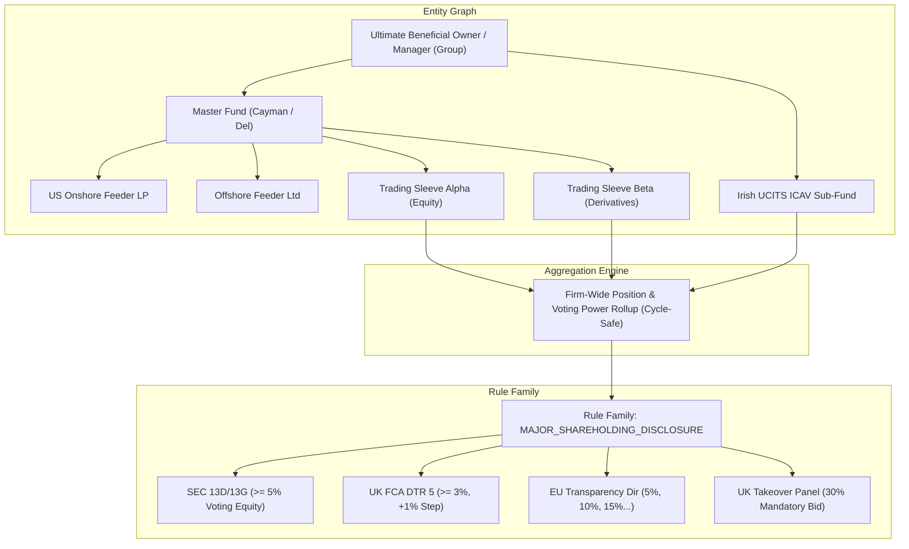

# Design Document: Phase VII Firm-Wide Ownership Aggregation, Fund Hierarchy Graph & Multi-Jurisdiction Rule Families

**Author:** Antigravity / Uisce Core Architecture Team  
**Date:** October 6, 2026  
**Status:** Approved for Implementation (Phase VII Entry)  
**Branch:** `feat/post-trade-phase7-ownership`  

---

## 1. Executive Summary & Strategic Rationale

Phase VII elevates firm-wide multi-account aggregation, fund hierarchy lookthrough, and major shareholding / short position disclosure rules to highest priority. Unlike external market-data-dependent rules (e.g. ADV liquidity schedules or historical rating transition matrices), Phase VII rules operate entirely on **internal platform data**:
1. Positions, derivative economic exposures, and order allocations across all trading accounts.
2. Fund structural relationships (Master-Feeder, Cayman feeders, Umbrella sub-funds, SMA sleeves).
3. Entity Beneficial Ownership Graphs (Ultimate Parent / Investment Manager group aggregation).
4. Tenant-provided Class B restricted and insider watchlists.

This architecture introduces two foundational primitives:
1. **The Fund & Entity Hierarchy Graph (`master.fund_hierarchy_edge`):** A bitemporal directed graph enabling deterministic aggregation of voting rights, gross equity holdings, and economic derivative exposures across complex institutional fund structures with guaranteed cycle-safety.
2. **The Rule Families Schema (`compliance.compliance_rule_family`):** A unified model where base compliance concepts (e.g. `MAJOR_SHAREHOLDING_DISCLOSURE`, `NET_SHORT_POSITION_DISCLOSURE`, `TAKEOVER_PANEL_MONITORING`) are parameterized across legal jurisdictions (SEC, FCA, ESMA, SFC, MAS) with jurisdiction-specific statutory thresholds, filing deadlines, and per-variant activation.



---

## 2. Fund Hierarchy & Entity Graph Data Model

### 2.1 Entity Relationship Primitives
To support multi-tier institutional fund structures without arbitrary nesting limits, the fund hierarchy is modeled as a directed graph with explicit relationship types and voting/economic pass-through weights:

```sql
-- master.fund_hierarchy_edge
CREATE TABLE IF NOT EXISTS master.fund_hierarchy_edge (
    id                 UUID PRIMARY KEY DEFAULT gen_random_uuid(),
    tenant_id          UUID NOT NULL,
    parent_account_id  UUID NOT NULL,
    child_account_id   UUID NOT NULL,
    relationship_type  TEXT NOT NULL CHECK (relationship_type IN (
        'MASTER_FEEDER',       -- Master fund holds underlying assets; feeder is investor
        'UMBRELLA_SUBFUND',    -- Legal umbrella entity containing sub-fund compartments
        'SMA_SLEEVE',          -- Separately Managed Account subdivided into trading sleeves
        'BENEFICIAL_OWNER',    -- Ultimate parent entity exercising investment discretion
        'PARALLEL_FUND'        -- Co-investing alongside master fund under common mandate
    )),
    economic_share_pct NUMERIC(10, 6) NOT NULL DEFAULT 1.000000, -- Equity ownership %
    voting_control_pct NUMERIC(10, 6) NOT NULL DEFAULT 1.000000, -- Voting discretion %
    valid_from         TIMESTAMPTZ NOT NULL DEFAULT now(),
    valid_to           TIMESTAMPTZ,
    created_at         TIMESTAMPTZ NOT NULL DEFAULT now(),
    updated_at         TIMESTAMPTZ NOT NULL DEFAULT now(),
    CONSTRAINT unq_fund_hierarchy_active UNIQUE (tenant_id, parent_account_id, child_account_id, relationship_type, valid_from)
);

CREATE INDEX IF NOT EXISTS idx_fund_hierarchy_lookup
    ON master.fund_hierarchy_edge (tenant_id, parent_account_id, child_account_id)
    WHERE valid_to IS NULL;
```

### 2.2 Aggregation Scopes
When evaluating compliance, rules declare an explicit **`AggregationScope`**:
- **`ACCOUNT_LEVEL`**: Standard single-account evaluation.
- **`MASTER_FEEDER_LOOKTHROUGH`**: Aggregates all feeder positions at the master fund level according to pro-rata investment.
- **`FIRM_WIDE_UBO`**: Aggregates all positions across every account, fund, and sleeve managed by the institutional tenant or parent investment manager entity.
- **`LEGAL_ENTITY_AGGREGATION`**: Aggregates across distinct legal entities that share beneficial control.

### 2.3 Cycle-Safe UBO Graph Traversal & Rule-Selected Weighting
Institutional fund structures frequently contain circular links (e.g., Feeder $\to$ Master Fund $\to$ Umbrella Compartment $\to$ Feeder). To prevent infinite recursion and duplicate double-counting:

1. **Cycle-Pruning Traversal Algorithm:**
   - Traversal uses a `visited` set tracking `(account_id)` along the active branch path.
   - If an edge targets an already-visited account in the current path, the cyclic edge is halted and logged as circular feedback without duplicate weight multiplication.
   - Cross-branch joins (e.g. diamond structures where two feeders invest in the same master) accumulate unique leaf positions once, scaled by their consolidated effective path weight.
2. **Rule-Selected Weight Selection:**
   - **Voting Rules** (SEC 13D/13G, UK FCA DTR5, EU Transparency, Takeover Code): Traversal multiplies `voting_control_pct` along graph edges.
   - **Economic Rules** (SSR Net Short, ERISA Plan Assets, Credit Concentration): Traversal multiplies `economic_share_pct` along graph edges.
3. **Adversarial Regression Requirement:**
   - Deterministic scenario corpus must include `SCENARIO_POST_TRADE_UBO_CYCLE_PRUNING_PASS` containing a deliberate 3-tier circular feeder loop, verifying that the traversal terminates in $<1\text{ms}$ and computes exact non-duplicated holdings.

---

## 3. Rule Families & Collision Protocol Resolution

### 3.1 Collision Protocol Amendment for Rule Families
The library collision protocol is explicitly amended as follows:
> **Rule Family Exception to Collision Guard:** Within a registered `compliance.compliance_rule_family`, multiple jurisdiction variant rules are expected and permitted to share the same primary metric path (e.g., `portfolio.firmwide_equity_voting_pct`), provided each variant differs in at least one of:
> 1. `jurisdiction_code` (e.g., `US_SEC` vs `UK_FCA` vs `EU_ESMA`),
> 2. Statutory threshold expression (e.g., $5.0\%$ vs $3.0\%$), or
> 3. Statutory filing deadline (`filing_deadline_hours`).
>
> The collision guard continues to strictly enforce metric uniqueness *across* distinct rule families and against standalone library rules.

### 3.2 Granular Per-Variant Activation
- Activation matrix (`compliance.tenant_rule_activation`) binds directly to individual `rule_id` records.
- Tenants can selectively activate individual jurisdiction variants (e.g. a US-only asset manager activates `POST_TRADE_SEC_SCHEDULE_13D_5PCT` without enabling UK DTR5 or EU SSR).
- UI/reporting surfaces group variants under their parent `compliance_rule_family` container for discovery and bulk toggling.

---

## 4. Event/Crossing Semantics in Batch Evaluator & Finding Lifecycle

### 4.1 Delta Crossing vs. Steady-State Semantics
Disclosure obligations (13D, DTR5, SSR) are **threshold-crossing events**, not indefinite concentration limits. Evaluating them as pure static ceilings causes infinite re-alerting on every batch run.

1. **Initial Crossing Detection:**
   $$\text{Triggered} \iff (\text{PriorMetric} < \text{Threshold} \land \text{CurrentMetric} \ge \text{Threshold})$$
2. **Step Crossing Detection (DTR5 1% Steps & SSR 0.1% Steps):**
   $$\text{Triggered} \iff \lfloor \frac{\text{CurrentMetric}}{\text{StepSize}} \rfloor > \lfloor \frac{\text{PriorMetric}}{\text{StepSize}} \rfloor$$
3. **Disposal Below Threshold Crossing:**
   $$\text{Triggered} \iff (\text{PriorMetric} \ge \text{Threshold} \land \text{CurrentMetric} < \text{Threshold})$$
   (Triggers filing obligation to disclose cessation of major shareholding, e.g. DTR 5.1.2R).
4. **Steady-State Suppression:**
   If $\text{CurrentMetric} \ge \text{Threshold}$ and $\text{PriorMetric} \ge \text{Threshold}$ within the same step bracket, the batch evaluator evaluates `Action = WITHIN_LIMITS` / `NO_NEW_BREACH` and does *not* emit duplicate alerts.

### 4.2 Extended Finding Lifecycle States
To support statutory filing workflows without breaking bitemporal supersession, the finding state machine is extended:

```
[ OPEN ]  ---(Compliance Acknowledges)--->  [ ACKNOWLEDGED ]
   |                                              |
   |                                       (Filing Made to Regulator)
   |                                              v
   |                                      [ FILING_SUBMITTED ]
   |                                              |
(Holding Drops Below Threshold)                   | (Disposal Confirmed)
   v                                              v
[ RESOLVED ] <------------------------------------+
```

- **`OPEN`**: New threshold crossing detected. Clock running against `filing_deadline_at`.
- **`ACKNOWLEDGED`**: Compliance officer acknowledged event; legal drafting in progress.
- **`FILING_SUBMITTED`**: Filing confirmed submitted to regulator (SEC EDGAR, FCA ESS, ESMA portal); statutory clock satisfied.
- **`RESOLVED`**: Holding reduced below disclosure threshold or disposal disclosure completed.
- **`SUPERSEDED`**: Superseded by a higher integer step-crossing finding on the same issuer.

---

## 5. Schema Extensions (Migration 018)

```sql
-- 1. Rule Family Definition Table
CREATE TABLE IF NOT EXISTS compliance.compliance_rule_family (
    id                UUID PRIMARY KEY DEFAULT gen_random_uuid(),
    family_code       TEXT NOT NULL UNIQUE,
    display_name      TEXT NOT NULL,
    description       TEXT NOT NULL,
    domain            TEXT NOT NULL CHECK (domain IN ('OWNERSHIP_DISCLOSURE', 'SHORT_SELLING', 'TAKEOVER_CONTROL', 'PLAN_ASSETS', 'INSIDER_RESTRICTIONS')),
    base_metric_path  TEXT NOT NULL,
    created_at        TIMESTAMPTZ NOT NULL DEFAULT now()
);

-- 2. Extend compliance.compliance_rule
ALTER TABLE compliance.compliance_rule
    ADD COLUMN IF NOT EXISTS rule_family_id UUID REFERENCES compliance.compliance_rule_family(id) ON DELETE SET NULL,
    ADD COLUMN IF NOT EXISTS jurisdiction_code TEXT,
    ADD COLUMN IF NOT EXISTS aggregation_scope TEXT NOT NULL DEFAULT 'ACCOUNT_LEVEL'
        CHECK (aggregation_scope IN ('ACCOUNT_LEVEL', 'MASTER_FEEDER_LOOKTHROUGH', 'FIRM_WIDE_UBO', 'LEGAL_ENTITY_AGGREGATION')),
    ADD COLUMN IF NOT EXISTS filing_deadline_hours INT;

-- 3. Extend compliance.compliance_finding status check
ALTER TABLE compliance.compliance_finding
    DROP CONSTRAINT IF EXISTS compliance_finding_status_check;

ALTER TABLE compliance.compliance_finding
    ADD CONSTRAINT compliance_finding_status_check
    CHECK (status IN ('OPEN', 'ACKNOWLEDGED', 'FILING_SUBMITTED', 'SUPERSEDED', 'RESOLVED', 'DISMISSED'));

-- 4. Class B Restricted & Insider Lists
CREATE TABLE IF NOT EXISTS compliance.compliance_restricted_list (
    id             UUID PRIMARY KEY DEFAULT gen_random_uuid(),
    tenant_id      UUID NOT NULL,
    list_code      TEXT NOT NULL,
    list_name      TEXT NOT NULL,
    list_type      TEXT NOT NULL CHECK (list_type IN ('RESTRICTED_TRADING', 'WATCHLIST', 'SANCTIONS_LOOKTHROUGH', 'EMPLOYEE_PRECLEAR')),
    is_active      BOOLEAN NOT NULL DEFAULT true,
    version        INT NOT NULL DEFAULT 1,
    created_at     TIMESTAMPTZ NOT NULL DEFAULT now(),
    updated_at     TIMESTAMPTZ NOT NULL DEFAULT now(),
    CONSTRAINT unq_restricted_list_code UNIQUE (tenant_id, list_code)
);

CREATE TABLE IF NOT EXISTS compliance.compliance_restricted_list_item (
    id                 UUID PRIMARY KEY DEFAULT gen_random_uuid(),
    tenant_id          UUID NOT NULL,
    list_id            UUID NOT NULL REFERENCES compliance.compliance_restricted_list(id) ON DELETE CASCADE,
    security_id        TEXT,
    issuer_id          TEXT NOT NULL,
    restriction_reason TEXT NOT NULL,
    restriction_scope  TEXT NOT NULL DEFAULT 'ALL_TRADING' CHECK (restriction_scope IN ('ALL_TRADING', 'BUYS_ONLY', 'SELLS_ONLY', 'DERIVATIVES_ONLY')),
    effective_from     TIMESTAMPTZ NOT NULL DEFAULT now(),
    effective_to       TIMESTAMPTZ,
    created_at         TIMESTAMPTZ NOT NULL DEFAULT now()
);
```

---

## 6. Phase VII Tranche 1 Rule Specifications (Rules 37–42)

| Rule Code | Family | Jurisdiction | Scope | Threshold / Trigger | Filing Deadline | Legal Citation |
|---|---|---|---|---|---|---|
| `POST_TRADE_SEC_SCHEDULE_13D_5PCT` | `MAJOR_SHAREHOLDING_DISCLOSURE` | `US_SEC` | `FIRM_WIDE_UBO` | Initial crossing $\ge 5.0\%$ voting equity | 5 business days (120h) | Exchange Act § 13(d)(1); SEC Rule 13d-1(a) (17 CFR § 240.13d-1(a)). |
| `POST_TRADE_UK_FCA_DTR5_INITIAL_3PCT` | `MAJOR_SHAREHOLDING_DISCLOSURE` | `UK_FCA` | `FIRM_WIDE_UBO` | Crossing $\ge 3.0\%$ + each 1% integer step | 2 trading days (48h) | UK FCA DTR 5.1.2R & 5.8.3R; Companies Act 2006. |
| `POST_TRADE_EU_TRANSPARENCY_DIR_5PCT` | `MAJOR_SHAREHOLDING_DISCLOSURE` | `EU_ESMA` | `FIRM_WIDE_UBO` | Crossing 5%, 10%, 15%, 20%, 25%, 30%, 50%, 75% | 4 trading days (96h) | Directive 2004/109/EC Art. 9(1) & Art. 12; CDR (EU) 2015/761. |
| `POST_TRADE_UK_TAKEOVER_MANDATORY_BID_30` | `TAKEOVER_PANEL_MONITORING` | `UK_TAKEOVER_PANEL` | `FIRM_WIDE_UBO` | Crossing $\ge 30.0\%$ voting rights of target | Immediate | Takeover Code Rule 9.1(a) & Rule 9.5; Companies Act 2006 Part 28. |
| `POST_TRADE_EU_SSR_SHORT_DISCLOSURE_01` | `NET_SHORT_POSITION_DISCLOSURE` | `EU_ESMA` | `FIRM_WIDE_UBO` | Net short position $\ge 0.10\%$ (and each 0.1% step) | 15:30 CET on T+1 | Regulation (EU) No 236/2012 Art. 5(1) & Art. 6(1). |
| `POST_TRADE_UK_FCA_SSR_SHORT_DISCLOSURE_02` | `NET_SHORT_POSITION_DISCLOSURE` | `UK_FCA` | `FIRM_WIDE_UBO` | Net short position $\ge 0.20\%$ (and each 0.1% step) | 15:30 UK on T+1 | UK Short Selling Regulation (SI 2012/2911) Art. 5 & Art. 6. |

---

## 7. Implementation & Verification Roadmap

1. **Tag & Branch:** Tag `v1.4.0-post-trade-phase2` on `main` and branch `feat/post-trade-phase7-ownership`.
2. **Migration 018:** Author `20261224_018_phase7_entity_graph_and_rule_families.up.sql` and `.down.sql`.
3. **Engine Extraction:** Author `metrics_ownership.go` with cycle-safe UBO graph lookthrough and delta crossing detection.
4. **Corpus Expansion:** Author 24 scenario vectors in `corpus_phase7.go` including cycle-pruning and step-crossing adversarial cases.
5. **Gates Execution:** Pass all 6 gates (92 rules, 92 snapshots, 368 vectors, clean `001 ↔ 018` migration chain, 0 live pollution).
