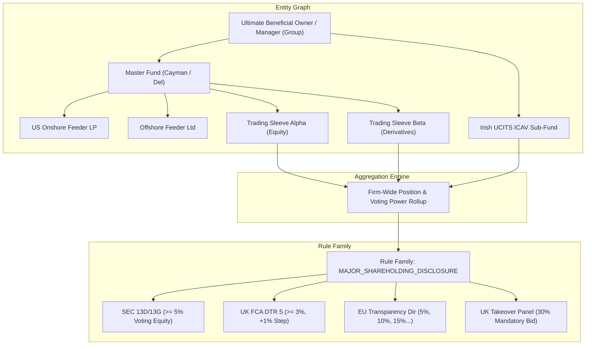

# Design Document: Phase VII Firm-Wide Ownership Aggregation, Fund Hierarchy Graph & Multi-Jurisdiction Rule Families

**Author:** Antigravity / Uisce Core Architecture Team  
**Date:** October 6, 2026  
**Status:** Approved for Implementation (Phase VII Entry)  
**Branch:** `feat/post-trade-100-rules-phase1-2`  

---

## 1. Executive Summary & Strategic Rationale

Phase VII elevates firm-wide multi-account aggregation, fund hierarchy lookthrough, and major shareholding / short position disclosure rules to highest priority. Unlike external market-data-dependent rules (e.g. ADV liquidity schedules or historical rating transition matrices), Phase VII rules operate entirely on **internal platform data**:
1. Positions, derivative economic exposures, and order allocations across all trading accounts.
2. Fund structural relationships (Master-Feeder, Cayman feeders, Umbrella sub-funds, SMA sleeves).
3. Entity Beneficial Ownership Graphs (Ultimate Parent / Investment Manager group aggregation).
4. Tenant-provided Class B restricted and insider watchlists.

This architecture introduces two foundational primitives:
1. **The Fund & Entity Hierarchy Graph (`master.entity_relationship` / `master.fund_structure`):** A bitemporal directed graph enabling deterministic aggregation of voting rights, gross equity holdings, and economic derivative exposures across complex institutional fund structures.
2. **The Rule Families Schema (`compliance.compliance_rule_family`):** A unified model where base compliance concepts (e.g. `BENEFICIAL_OWNERSHIP_DISCLOSURE`, `NET_SHORT_POSITION_REPORTING`, `TAKEOVER_CONCENTRATION_TRIGGER`) are parameterized across legal jurisdictions (SEC, FCA, ESMA, SFC, MAS) with jurisdiction-specific statutory thresholds, filing deadlines, and aggregation scopes.



---

## 2. Fund Hierarchy & Entity Graph Data Model

### 2.1 Entity Relationship Primitives
To support multi-tier institutional fund structures without arbitrary nesting limits, the fund hierarchy is modeled as a directed acyclic graph (DAG) with explicit relationship types and voting/economic pass-through weights:

```sql
-- master.fund_hierarchy_edge
CREATE TABLE IF NOT EXISTS master.fund_hierarchy_edge (
    id                 UUID PRIMARY KEY DEFAULT gen_random_uuid(),
    tenant_id          UUID NOT NULL,
    parent_account_id  UUID NOT NULL,
    child_account_id   UUID NOT NULL,
    relationship_type  TEXT NOT NULL CHECK (relationship_type IN (
        'MASTER_FEEDER',       -- Master fund holds underlying assets; feeder is investor
        'UMBRELLA_SUBFUND',    -- Legal umbrella entity containing sub-fund compartments
        'SMA_SLEEVE',          -- Separately Managed Account subdivided into trading sleeves
        'BENEFICIAL_OWNER',    -- Ultimate parent entity exercising investment discretion
        'PARALLEL_FUND'        -- Co-investing alongside master fund under common mandate
    )),
    economic_share_pct NUMERIC(10, 6) NOT NULL DEFAULT 1.000000, -- Equity ownership %
    voting_control_pct NUMERIC(10, 6) NOT NULL DEFAULT 1.000000, -- Voting discretion %
    valid_from         TIMESTAMPTZ NOT NULL DEFAULT now(),
    valid_to           TIMESTAMPTZ,
    created_at         TIMESTAMPTZ NOT NULL DEFAULT now(),
    updated_at         TIMESTAMPTZ NOT NULL DEFAULT now(),
    CONSTRAINT unq_fund_hierarchy_active UNIQUE (tenant_id, parent_account_id, child_account_id, relationship_type, valid_from)
);
```

### 2.2 Aggregation Scopes
When evaluating compliance, rules declare an **`AggregationScope`**:
- **`ACCOUNT_LEVEL`**: Standard single-account evaluation.
- **`MASTER_FEEDER_LOOKTHROUGH`**: Aggregates all feeder positions at the master fund level according to pro-rata investment.
- **`FIRM_WIDE_UBO`**: Aggregates all positions across every account, fund, and sleeve managed by the institutional tenant or parent investment manager entity.
- **`LEGAL_ENTITY_AGGREGATION`**: Aggregates across distinct legal entities that share beneficial control.

---

## 3. Rule Families Schema Architecture

Rules that share core economic math across jurisdictions are linked to a common **Rule Family**, eliminating redundant boilerplate while capturing statutory differences (e.g. SEC Schedule 13D vs UK FCA DTR5 vs EU Transparency Directive).

```sql
-- compliance.compliance_rule_family
CREATE TABLE IF NOT EXISTS compliance.compliance_rule_family (
    id                UUID PRIMARY KEY DEFAULT gen_random_uuid(),
    family_code       TEXT NOT NULL UNIQUE,
    display_name      TEXT NOT NULL,
    description       TEXT NOT NULL,
    domain            TEXT NOT NULL CHECK (domain IN ('OWNERSHIP_DISCLOSURE', 'SHORT_SELLING', 'TAKEOVER_CONTROL', 'PLAN_ASSETS', 'INSIDER_RESTRICTIONS')),
    base_metric_path  TEXT NOT NULL, -- e.g. "portfolio.firmwide_equity_voting_pct"
    created_at        TIMESTAMPTZ NOT NULL DEFAULT now()
);

-- Extend compliance.compliance_rule
ALTER TABLE compliance.compliance_rule
    ADD COLUMN IF NOT EXISTS rule_family_id UUID REFERENCES compliance.compliance_rule_family(id) ON DELETE SET NULL,
    ADD COLUMN IF NOT EXISTS jurisdiction_code TEXT,
    ADD COLUMN IF NOT EXISTS aggregation_scope TEXT NOT NULL DEFAULT 'ACCOUNT_LEVEL'
        CHECK (aggregation_scope IN ('ACCOUNT_LEVEL', 'MASTER_FEEDER_LOOKTHROUGH', 'FIRM_WIDE_UBO', 'LEGAL_ENTITY_AGGREGATION')),
    ADD COLUMN IF NOT EXISTS filing_deadline_hours INT;
```

---

## 4. Phase VII Tranche 1 Rule Specifications

### 4.1 Rule Family: `MAJOR_SHAREHOLDING_DISCLOSURE`
- **Family Code:** `MAJOR_SHAREHOLDING_DISCLOSURE`
- **Base Metric:** `portfolio.firmwide_equity_voting_pct` (Total voting shares held firm-wide divided by total shares outstanding of issuer).

#### 1. Rule 37: `POST_TRADE_SEC_SCHEDULE_13D_5PCT`
- **Jurisdiction:** `US_SEC`
- **Aggregation Scope:** `FIRM_WIDE_UBO`
- **Rule Threshold:** $\ge 5.0\%$ of registered class of equity securities.
- **Filing Deadline:** 5 business days (120 hours) under SEC Modernized Beneficial Ownership Reporting (Release No. 33-11253).
- **Statutory Citation:** Securities Exchange Act of 1934 Section 13(d)(1) (15 U.S.C. § 78m(d)); SEC Rule 13d-1(a) (17 CFR § 240.13d-1(a)).

#### 2. Rule 38: `POST_TRADE_UK_FCA_DTR5_INITIAL_3PCT`
- **Jurisdiction:** `UK_FCA`
- **Aggregation Scope:** `FIRM_WIDE_UBO`
- **Rule Threshold:** $\ge 3.0\%$ of total voting rights in UK issuer (and each 1% integer increment above 3%).
- **Filing Deadline:** 2 trading days (48 hours).
- **Statutory Citation:** UK FCA Disclosure Guidance and Transparency Rules (DTR) Sourcebook 5.1.2R & 5.8.3R; Companies Act 2006.

#### 3. Rule 39: `POST_TRADE_EU_TRANSPARENCY_DIR_5PCT`
- **Jurisdiction:** `EU_ESMA`
- **Aggregation Scope:** `FIRM_WIDE_UBO`
- **Rule Threshold:** $\ge 5.0\%$ of total voting rights in EU regulated market issuer (tiers: 5%, 10%, 15%, 20%, 25%, 30%, 50%, 75%).
- **Filing Deadline:** 4 trading days (96 hours).
- **Statutory Citation:** Directive 2004/109/EC (Transparency Directive) Art. 9(1) and Art. 12; Commission Delegated Regulation (EU) 2015/761.

---

### 4.2 Rule Family: `TAKEOVER_PANEL_MONITORING`
- **Family Code:** `TAKEOVER_PANEL_MONITORING`
- **Base Metric:** `portfolio.firmwide_voting_control_pct`

#### 4. Rule 40: `POST_TRADE_UK_TAKEOVER_MANDATORY_BID_30`
- **Jurisdiction:** `UK_TAKEOVER_PANEL`
- **Aggregation Scope:** `FIRM_WIDE_UBO`
- **Rule Threshold:** $\ge 30.0\%$ voting rights of a target company carrying voting rights, triggering mandatory cash offer to all shareholders.
- **Filing Deadline:** Immediate disclosure.
- **Statutory Citation:** The Takeover Code (City Code on Takeovers and Mergers) Rule 9.1(a) & Rule 9.5; Companies Act 2006 Part 28.

---

### 4.3 Rule Family: `NET_SHORT_POSITION_DISCLOSURE`
- **Family Code:** `NET_SHORT_POSITION_DISCLOSURE`
- **Base Metric:** `portfolio.firmwide_net_short_pct` (Aggregate physical shorts + economic short swap exposure minus physical longs).

#### 5. Rule 41: `POST_TRADE_EU_SSR_SHORT_DISCLOSURE_01`
- **Jurisdiction:** `EU_ESMA`
- **Aggregation Scope:** `FIRM_WIDE_UBO`
- **Rule Threshold:** $\ge 0.10\%$ net short position in shares admitted to trading on an EU trading venue (public disclosure at $\ge 0.50\%$).
- **Filing Deadline:** 15:30 CET on trading day T+1.
- **Statutory Citation:** Regulation (EU) No 236/2012 (Short Selling Regulation) Art. 5(1) (as amended by Regulation (EU) 2022/27) & Art. 6(1).

#### 6. Rule 42: `POST_TRADE_UK_FCA_SSR_SHORT_DISCLOSURE_02`
- **Jurisdiction:** `UK_FCA`
- **Aggregation Scope:** `FIRM_WIDE_UBO`
- **Rule Threshold:** $\ge 0.20\%$ net short position in UK sovereign debt or shares.
- **Filing Deadline:** 15:30 UK time on T+1.
- **Statutory Citation:** UK Short Selling Regulation (SI 2012/2911) Art. 5 & Art. 6; FCA Handbook SSR Rules.

---

## 5. Class B Restricted & Insider List Ingestion Pipeline

To provide a fully deterministic, vendor-independent data path for insider lists and deal-specific restricted trading lists:

```sql
-- compliance.compliance_restricted_list
CREATE TABLE IF NOT EXISTS compliance.compliance_restricted_list (
    id             UUID PRIMARY KEY DEFAULT gen_random_uuid(),
    tenant_id      UUID NOT NULL,
    list_code      TEXT NOT NULL, -- 'INSIDER_WATCHLIST', 'M_AND_A_RESTRICTED', 'SANCTIONS_CONTROL'
    list_name      TEXT NOT NULL,
    list_type      TEXT NOT NULL CHECK (list_type IN ('RESTRICTED_TRADING', 'WATCHLIST', 'SANCTIONS_LOOKTHROUGH', 'EMPLOYEE_PRECLEAR')),
    is_active      BOOLEAN NOT NULL DEFAULT true,
    version        INT NOT NULL DEFAULT 1,
    created_at     TIMESTAMPTZ NOT NULL DEFAULT now(),
    updated_at     TIMESTAMPTZ NOT NULL DEFAULT now(),
    CONSTRAINT unq_restricted_list_code UNIQUE (tenant_id, list_code)
);

-- compliance.compliance_restricted_list_item
CREATE TABLE IF NOT EXISTS compliance.compliance_restricted_list_item (
    id                 UUID PRIMARY KEY DEFAULT gen_random_uuid(),
    tenant_id          UUID NOT NULL,
    list_id            UUID NOT NULL REFERENCES compliance.compliance_restricted_list(id) ON DELETE CASCADE,
    security_id        TEXT,
    issuer_id          TEXT NOT NULL,
    restriction_reason TEXT NOT NULL,
    restriction_scope  TEXT NOT NULL DEFAULT 'ALL_TRADING' CHECK (restriction_scope IN ('ALL_TRADING', 'BUYS_ONLY', 'SELLS_ONLY', 'DERIVATIVES_ONLY')),
    effective_from     TIMESTAMPTZ NOT NULL DEFAULT now(),
    effective_to       TIMESTAMPTZ,
    created_at         TIMESTAMPTZ NOT NULL DEFAULT now()
);
```

---

## 6. Implementation Plan & Verification Gates

1. **Migration 018:**
   - Create `master.fund_hierarchy_edge`.
   - Create `compliance.compliance_rule_family`.
   - Add `rule_family_id`, `jurisdiction_code`, `aggregation_scope`, `filing_deadline_hours` to `compliance.compliance_rule`.
   - Create `compliance.compliance_restricted_list` & `compliance.compliance_restricted_list_item`.
   - Seed Rule Families and Tranche 1 Phase VII rules (Rules 37–42).
2. **Engine Extension:**
   - Add `metrics_ownership.go` under `backend/internal/compliance/engine/` implementing firm-wide voting equity, takeover control, and net short position aggregation.
3. **Corpus Expansion:**
   - Author 24 new deterministic scenarios in `backend/internal/compliance/library/corpus_phase7.go` (4 per rule across Rules 37–42).
   - Total library size increases from 86 to **92 rules** ($86 + 6$), and corpus from 344 to **368 vectors** ($344 + 24$).
4. **Gates:**
   - Zero-diff schema parity across all compliance tables.
   - Clean `001 ↔ 018` up/down migration test.
   - Zero test pollution on live Alpha.
