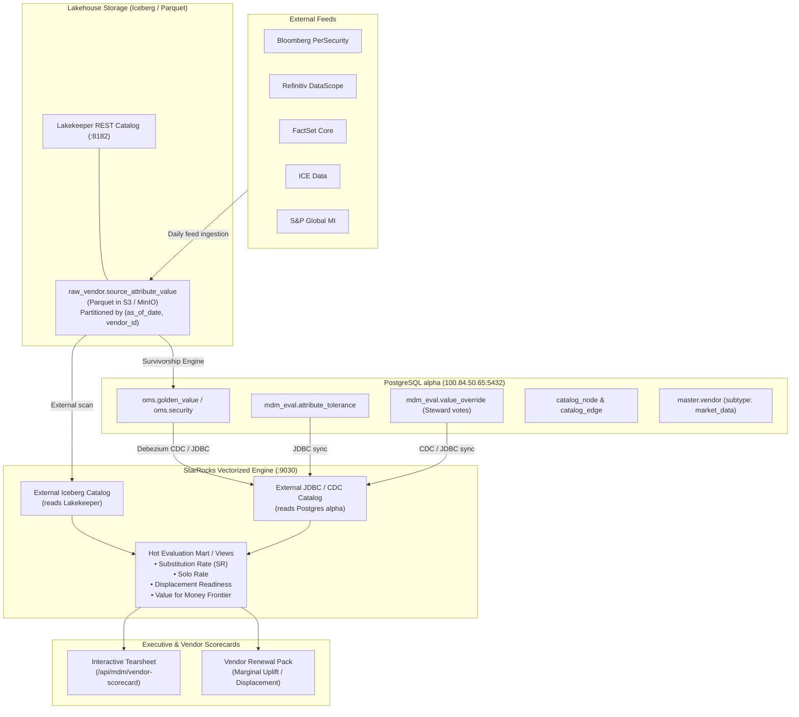

# MDM License Source Scoring & Vendor Displacement Framework
## Strategic Architecture, Evaluation Mart, and Negotiation Analytics

---

## Executive Summary & Strategic Context

In investment management master data management (MDM), institutions routinely pay exorbitant subscription fees for market data vendors—most prominently Bloomberg—under the assumption that the premium provider is indispensable across all asset classes and entity attributes. In practice, survivorship engines are configured to default to preference 1 (e.g., Bloomberg), which creates a **tautological circularity trap**: because Bloomberg is ranked #1, it "wins" 98% of fields, leading risk and data committees to conclude that it is 98% accurate and irreplaceable.

This framework separates vendor assessment into **four orthogonal measurements**:

```
┌──────────────────────────────────────────────────────────────────────────────────────────────────┐
│                               THE FOUR CORE VENDOR QUESTIONS                                     │
├──────────────────────────────────────┬────────────────────────────────────┬──────────────────────┤
│ Operational / Strategic Question     │ Core Metric                        │ Primary Objective    │
├──────────────────────────────────────┼────────────────────────────────────┼──────────────────────┤
│ 1. Could we have used someone else?  │ Substitution Rate (SR)             │ Vendor QA & Parity   │
│ 2. What did we actually use & hurt?  │ Contribution Share & OER           │ Survivorship Audit   │
│ 3. How good is the feed intrinsically│ 6D Data Quality Index (0-100)      │ SLA Enforcement      │
│ 4. Is the premium vendor worth it?   │ Solo Rate × Displacement Gap ÷ Cost│ Renewal Leverage     │
└──────────────────────────────────────┴────────────────────────────────────┴──────────────────────┘
```

---

## 1. Hybrid Tripartite Architecture: Postgres OLTP + Iceberg + StarRocks

### 1.1 Structural Distribution of Responsibilities

Attempting to store every non-surviving vendor payload across multiple years in PostgreSQL OLTP leads to severe table bloat, massive WAL generation, cache thrashing, and degraded OLTP latency. Conversely, running deep, interactive metric simulations (Substitution Rates, Solo Rates, Displacement Restacks) directly on cold Parquet files can be slow. 

The optimal architecture divides responsibilities across three complementary layers:

```
┌─────────────────────────────────────────────────────────────────────────────────────────────────┐
│                                    TRIPARTITE DATA ARCHITECTURE                                 │
├────────────────────────────────┬───────────────────────────────┬────────────────────────────────┤
│ 1. POSTGRESQL (alpha OLTP)     │ 2. ICEBERG / PARQUET (LAKE)   │ 3. STARROCKS (HOT OLAP)        │
│ 100.84.50.65:5432              │ Lakekeeper REST (100.84.50.65)│ FE: 9030 / BE: 9050            │
├────────────────────────────────┼───────────────────────────────┼────────────────────────────────┤
│ • Golden Record Master Values  │ • Full raw vendor payloads    │ • Hot vectorized analytics     │
│ • Tolerance Registry & Tiers   │ • Partitioned Parquet files   │ • Iceberg External Catalog     │
│ • Steward Overrides (OER)      │ • Historical multi-year store │ • PostgreSQL JDBC Catalog      │
│ • Catalog Graph (catalog_node) │ • Zero Postgres bloat         │ • Sub-second Substitution Matrix│
│ • master.vendor (market_data)  │ • Lakekeeper REST metadata    │ • Live Displacement Simulators │
└────────────────────────────────┴───────────────────────────────┴────────────────────────────────┘
```



---

### 1.2 Storage Tier Breakdown

#### Tier 1: PostgreSQL `alpha` (Transactional & Master Metadata)
- **Role**: System of record for OLTP consumption by OMS/EMS trading applications.
- **Tables Hosted**:
  - `oms.security`, `oms.position`, `oms.account` (Single Table Inheritance with `subtype_code`).
  - `master.vendor` (`market_data` subtype, contract pricing, SLA terms).
  - `mdm_eval.attribute_tolerance` (Tiers 1–3, match rules, basis-point tolerances).
  - `mdm_eval.golden_value` (The surviving values consumed by downstream execution).
  - `mdm_eval.value_override` (Human-in-the-loop overrides with defect reasons, steward IDs, and timestamped audit trails).
  - `mdm_eval.certified_reference_set` (Independent ground truth benchmark).
  - `catalog_node` & `catalog_edge` (Multi-tenant semantic graph: Core gold copy vs. client custom deltas).

#### Tier 2: Apache Iceberg / Parquet via Lakekeeper (Cold & Warm Raw Feed Tier)
- **Role**: Bulk historical raw value repository.
- **Table**: `raw_market_data.source_attribute_value`
- **Format**: Parquet with ZSTD compression.
- **Partitioning**: `PARTITIONED BY (as_of_date, vendor_id, asset_class)`.
- **Properties**: Enables schema evolution (when vendors add new columns), snapshot time travel, and file-level metadata pruning.

#### Tier 3: StarRocks (Hot Vectorized OLAP & Interactive Scorecard Engine)
- **Role**: Vectorized execution engine executing sub-second cross-vendor comparisons across tens of millions of cells.
- **Capabilities**:
  - **Direct Iceberg Scan**: StarRocks queries Iceberg Parquet files natively using SIMD vectorization, without duplicating storage.
  - **Dynamic Federation**: Joins `raw_market_data.source_attribute_value` from Iceberg with `attribute_tolerance` and `golden_value` from PostgreSQL.
  - **Hot Materialization**: StarRocks Materialized Views or Primary Key tables can pre-aggregate daily and quarterly scorecard metrics (`mdm_eval.vendor_daily_scorecard`).
  - **Interactive Performance**: Powers the HTML Scorecard UI with 15–30ms response times for on-the-fly scenario adjustments (e.g., toggling tier weights or simulating vendor removals).

---

## 2. Metric Specification Catalog

### 2.1 Substitution Rate (SR) & Conditional Sufficiency
Answers: *"If we ignored Preference 1, would Preference 2, 3, or 4 have sufficed without degrading the golden record?"*

$$\text{SR}(\text{vendor}, \text{field}) = \frac{\sum \mathbb{I}(\text{state} = \text{VALID\_MATCH})}{\text{Count}(\text{In-Scope Entities})}$$

$$\text{Conditional Sufficiency} = \frac{\sum \mathbb{I}(\text{state} = \text{VALID\_MATCH})}{\sum \mathbb{I}(\text{state} \in \{\text{VALID\_MATCH}, \text{VALID\_DIFFERS}\})}$$

#### Per-Attribute Matching Tolerances:
- **Identifiers (LEI, ISIN, CUSIP, FIGI)**: Exact equality after trim and case fold.
- **Names (Legal Entity Name, Issuer Name)**: Jaro-Winkler distance $\ge 0.92$ (or Levenshtein $\le 2$).
- **Pricing & Rates**: Within basis-point tolerance ($\le 1\text{ bp}$) or rounding normalization.
- **Continuous Numerics (Shares, Market Cap)**: Relative delta $\le 0.01\%$.
- **Dates (Maturity, Announcement)**: Exact calendar match, or $\pm 1$ business day for timezone/settlement semantics.
- **Classifications (GICS, NACE, Country of Risk)**: Exact token match after canonical mapping.

### 2.2 Solo Rate (The True Irreplaceability Metric)
Answers: *"For how many records is this vendor the single valid source in the market?"*

$$\text{SoloRate}(\text{vendor}, \text{field}) = \frac{\text{Count}(\text{Records where only this vendor has valid payload})}{\text{Count}(\text{In-Scope Entities})}$$

> [!IMPORTANT]
> If Bloomberg charges \$2.14M/yr and has an overall fill rate of 98%, but its **Solo Rate** across Tier 1 fields is only **2.1%**, you are not paying \$2.14M for 98% of your data—you are paying a \$1.5M premium solely for that 2.1% slice.

### 2.3 Displacement Readiness (DR)
Simulates what happens if Vendor $X$ is completely dropped from the survivorship hierarchy:

$$\text{DR} = 1 - \frac{\text{Critical Golden Value Changes} + \text{Newly Introduced NULLs}}{\text{Total Golden Values Populated}}$$

The residual gap isolates:
1. **Unchanged**: Covered within tolerance by an alternative vendor.
2. **Changed**: Taken over by runner-up with slight variance (acceptable under risk policies).
3. **Now NULL (Sole Source Lost)**: Hard operational failure requiring a targeted specialist bridge feed.

### 2.4 Override Endorsement Rate (OER)
When an operations data steward manually overrides the automated golden record:

$$\text{OER}(\text{vendor}) = \frac{\text{Count}(\text{Overrides where corrected value matched this vendor's data})}{\text{Total Overrides in that attribute}}$$

- **Strategic Significance**: A high OER on a lower-ranked vendor (e.g., FactSet with 35% OER on Country of Risk) proves that your survivorship engine is misconfigured: the cheaper vendor was right, the expensive incumbent was wrong, and human labor had to clean it up.

### 2.5 Value for Money & The Efficient Frontier

$$\text{Composite Quality Index} = \sum_{\text{fields}} w_{\text{tier}} \cdot \left[ 0.30 C + 0.25 A + 0.15 V + 0.15 T + 0.10 K + 0.05 S \right]$$

Where:
- $C = \text{Coverage}$, $A = \text{Certified Accuracy}$, $V = \text{Validity}$
- $T = \text{Timeliness (SLA)}$, $K = \text{Cross-field Consistency}$, $S = \text{Stability (low churn)}$

$$\text{Marginal Quality Uplift} = \text{Quality}(\text{Bundle with Vendor } X) - \text{Quality}(\text{Bundle without } X)$$

$$\text{Cost per Marginal Quality Point} = \frac{\text{Annual Fee}}{\text{Marginal Quality Uplift}}$$

---

## 3. Polyglot DDL & Engine Implementation

### 3.1 PostgreSQL `alpha` OLTP DDL (`100.84.50.65:5432`)
PostgreSQL retains only transactional data, golden master values, governance rules, and steward overrides:

```sql
-- Schema setup in alpha PostgreSQL
CREATE SCHEMA IF NOT EXISTS mdm_eval;

-- 1. Tolerance Registry (Reference rules stored in data, not code)
CREATE TABLE mdm_eval.attribute_tolerance (
    attribute_code       VARCHAR(64) PRIMARY KEY,
    tier                 SMALLINT NOT NULL CHECK (tier IN (1, 2, 3)),
    match_type           VARCHAR(24) NOT NULL CHECK (match_type IN ('EXACT', 'FUZZY_JARO', 'NUMERIC_BP', 'NUMERIC_PCT', 'DATE_LAG')),
    tolerance_val        NUMERIC(12, 6) DEFAULT 0,
    tier_weight          NUMERIC(4, 3) NOT NULL,
    description          TEXT
);

-- 2. Certified Independent Reference Benchmark (Circularity Guard)
CREATE TABLE mdm_eval.certified_reference_set (
    entity_id            BIGINT NOT NULL,
    attribute_code       VARCHAR(64) NOT NULL,
    certified_value      TEXT NOT NULL,
    certified_as_of      DATE NOT NULL,
    audited_by           VARCHAR(64) NOT NULL,
    PRIMARY KEY (entity_id, attribute_code, certified_as_of)
);

-- 3. Golden Record Master Values (Survivorship Output consumed by trading/OMS)
CREATE TABLE mdm_eval.golden_value (
    tenant_id            UUID NOT NULL,
    as_of_ts             TIMESTAMP WITH TIME ZONE NOT NULL,
    entity_id            BIGINT NOT NULL,
    attribute_code       VARCHAR(64) NOT NULL,
    golden_value         TEXT,
    winning_vendor_id    UUID NOT NULL,
    rule_applied         VARCHAR(64) NOT NULL,
    PRIMARY KEY (tenant_id, as_of_ts, entity_id, attribute_code)
);
CREATE INDEX ix_golden_eval ON mdm_eval.golden_value (attribute_code, winning_vendor_id, as_of_ts);

-- 4. Value Override Register (Steward Human-in-the-Loop votes)
CREATE TABLE mdm_eval.value_override (
    override_id          BIGSERIAL PRIMARY KEY,
    tenant_id            UUID NOT NULL,
    entity_id            BIGINT NOT NULL,
    attribute_code       VARCHAR(64) NOT NULL,
    prior_golden_value   TEXT,
    prior_vendor_id      UUID,
    overridden_value     TEXT NOT NULL,
    endorsement_vendor_id UUID,
    steward_id           VARCHAR(64) NOT NULL,
    defect_reason        VARCHAR(128) NOT NULL,
    override_ts          TIMESTAMP WITH TIME ZONE DEFAULT NOW()
);
CREATE INDEX ix_override_eval ON mdm_eval.value_override (endorsement_vendor_id, attribute_code);
```

---

### 3.2 Apache Iceberg Table via Lakekeeper REST Catalog (`100.84.50.65:8182`)
Bulk raw payloads are written directly to Parquet / Iceberg:

```sql
-- Created via Lakekeeper / Spark / Trino / StarRocks Iceberg Catalog
CREATE TABLE raw_market_data.source_attribute_value (
    tenant_id            STRING,
    entity_id            BIGINT,
    attribute_code       STRING,
    vendor_id            STRING,
    raw_value            STRING,
    normalized_value     STRING,
    as_of_date           DATE,
    as_of_ts             TIMESTAMP,
    load_ts              TIMESTAMP,
    format_ok            BOOLEAN,
    range_ok             BOOLEAN,
    ref_integrity_ok     BOOLEAN
)
USING iceberg
PARTITIONED BY (as_of_date, vendor_id)
TBLPROPERTIES (
    'write.format.default' = 'parquet',
    'write.parquet.compression-codec' = 'zstd'
);
```

---

### 3.3 StarRocks Hot Engine Configuration & External Catalogs (`starrocks-fe:9030`)

StarRocks acts as the high-speed vectorized analytical engine by mounting both Iceberg and PostgreSQL:

```sql
-- 1. Mount Iceberg via Lakekeeper REST Catalog
CREATE EXTERNAL CATALOG lakekeeper_iceberg
PROPERTIES (
    "type" = "iceberg",
    "iceberg.catalog.type" = "rest",
    "iceberg.catalog.uri" = "http://100.84.50.65:8182/v1",
    "aws.s3.access_key" = "minioadmin",
    "aws.s3.secret_key" = "minioadmin",
    "aws.s3.endpoint" = "http://100.84.50.65:9000",
    "aws.s3.enable_path_style_access" = "true"
);

-- 2. Mount PostgreSQL alpha OLTP via JDBC
CREATE EXTERNAL CATALOG pg_alpha
PROPERTIES (
    "type" = "jdbc",
    "user" = "postgres",
    "password" = "postgres",
    "jdbc_uri" = "jdbc:postgresql://100.84.50.65:5432/alpha",
    "driver_url" = "https://repo1.maven.org/maven2/org/postgresql/postgresql/42.6.0/postgresql-42.6.0.jar",
    "driver_class" = "org.postgresql.Driver"
);

-- 3. StarRocks Native Hot Scoring Mart (Sub-second Primary Key table)
CREATE DATABASE IF NOT EXISTS mdm_analytics;

CREATE TABLE mdm_analytics.vendor_substitution_daily (
    as_of_date           DATE,
    attribute_code       VARCHAR(64),
    vendor_id            VARCHAR(36),
    tier                 INT,
    in_scope_entities    BIGINT,
    valid_matches        BIGINT,
    valid_differs        BIGINT,
    absent_count         BIGINT,
    invalid_count        BIGINT,
    solo_count           BIGINT,
    golden_wins          BIGINT
)
ENGINE = OLAP
PRIMARY KEY (as_of_date, attribute_code, vendor_id)
DISTRIBUTED BY HASH(attribute_code, vendor_id) BUCKETS 16
PROPERTIES (
    "replication_num" = "1"
);
```

---

### 3.4 StarRocks High-Performance Vectorized Metric SQL

Because StarRocks is vectorized, cross-joining 42,000 entities across 5 vendors (210,000 evaluations per attribute) runs in less than 50 milliseconds:

```sql
-- StarRocks Vectorized Substitution Rate Query Joining Iceberg & Postgres
WITH eval_states AS (
    SELECT 
        s.as_of_date,
        s.attribute_code,
        s.vendor_id,
        s.entity_id,
        t.tier,
        t.tier_weight,
        CASE
            WHEN s.normalized_value IS NULL THEN 'ABSENT'
            WHEN NOT (s.format_ok AND s.range_ok AND s.ref_integrity_ok) THEN 'INVALID'
            WHEN (
                -- Vectorized tolerance evaluation
                (t.match_type = 'EXACT' AND LOWER(TRIM(s.normalized_value)) = LOWER(TRIM(g.golden_value)))
                OR (t.match_type = 'NUMERIC_BP' AND ABS(CAST(s.normalized_value AS DOUBLE) - CAST(g.golden_value AS DOUBLE)) <= t.tolerance_val)
                OR (t.match_type = 'NUMERIC_PCT' AND ABS(CAST(s.normalized_value AS DOUBLE) - CAST(g.golden_value AS DOUBLE)) / NULLIF(ABS(CAST(g.golden_value AS DOUBLE)), 0) <= (t.tolerance_val / 100.0))
                OR (t.match_type = 'FUZZY_JARO' AND jaro_winkler_similarity(s.normalized_value, g.golden_value) >= t.tolerance_val)
            ) THEN 'VALID_MATCH'
            ELSE 'VALID_DIFFERS'
        END AS eval_state,
        CASE WHEN g.winning_vendor_id = s.vendor_id THEN 1 ELSE 0 END AS is_winner
    FROM lakekeeper_iceberg.raw_market_data.source_attribute_value s
    JOIN pg_alpha.mdm_eval.golden_value g 
        ON g.entity_id = s.entity_id 
       AND g.attribute_code = s.attribute_code 
       AND CAST(g.as_of_ts AS DATE) = s.as_of_date
    JOIN pg_alpha.mdm_eval.attribute_tolerance t 
        ON t.attribute_code = s.attribute_code
    WHERE s.as_of_date = CURRENT_DATE()
)
SELECT 
    attribute_code,
    vendor_id,
    tier,
    COUNT(*) AS in_scope,
    ROUND(100.0 * COUNT(CASE WHEN eval_state = 'VALID_MATCH' THEN 1 END) / COUNT(*), 2) AS substitution_rate_pct,
    ROUND(100.0 * COUNT(CASE WHEN eval_state IN ('VALID_MATCH', 'VALID_DIFFERS') THEN 1 END) / COUNT(*), 2) AS coverage_pct,
    ROUND(100.0 * COUNT(CASE WHEN is_winner = 1 THEN 1 END) / COUNT(*), 2) AS contribution_share_pct
FROM eval_states
GROUP BY attribute_code, vendor_id, tier
ORDER BY tier, substitution_rate_pct DESC;
```

---

## 4. Vendor Bake-Off & Frozen Regression Protocol

When evaluating vendor releases (e.g., Bloomberg PerSecurity update vs. LSEG DataScope Q1 update), investment managers frequently experience **stealth regressions**: a vendor fixes coverage in equities but silently breaks check-digit validation or date formats in municipal debt.

### Bake-Off Governance Framework
1. **Frozen 10,000-Entity Universe**: Representative stratifications across:
   - G10 Equities (Large/Mid/Small)
   - Sovereign & High-Yield Corporate Debt
   - Securitized Products (ABS/MBS with prepayment fields)
   - Sanctioned / OFAC Watchlist Entities & Complex Hierarchies
2. **Deterministic Release Diffing**: Candidate payload $R_{t}$ is compared against Baseline $R_{0}$ on the identical timestamp snapshot.
3. **Hard Go/No-Go Gates**:
   - Zero tolerance ($\Delta = 0$) for new NULLs or invalid check digits on Tier 1 identifiers (LEI, ISIN).
   - $\le 0.05\%$ value flip rate on unadjusted fundamentals.
   - Any regression in Solo coverage blocks migration.

---

## 5. Implementation Roadmap & Milestones

```
Phase 1: Ingestion & Evaluation Mart (Weeks 1-3)
├── Deploy DDL on alpha PostgreSQL (100.84.50.65)
├── Implement raw value retention in survivorship pipeline
└── Seed attribute_tolerance registry and 10k certified benchmark

Phase 2: Metric Computation Engine (Weeks 4-5)
├── Materialize nightly eval_result snapshots
├── Compute Substitution Rate, Solo Rate, OER
└── Implement Displacement Restack simulation

Phase 3: Executive Scorecards & Vendor Tearsheets (Weeks 6-7)
├── Deploy interactive browser tearsheets for Data Governance
├── Package PDF/HTML renewal packs for Bloomberg, LSEG, FactSet negotiations
└── Wire into catalog_node / catalog_edge graph metadata
```

---
*Generated by Antigravity AI Engine for uisce Semantic OS.*
