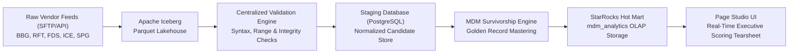

# Master Data Management (MDM) Source Scoring & Vendor Displacement: Complete Training Guide

Welcome to the **MDM Source Scoring & Vendor Displacement** training manual. This guide is written for anyone who needs to understand, operate, or make decisions using this system—even if you have never worked with master data, financial pricing feeds, or vendor contracts before.

---

## 1. Executive Summary & Why This System Matters

Every major institutional investment firm, wealth manager, and hedge fund subscribes to external market data feeds from vendors such as **Bloomberg (BBG)**, **Refinitiv (LSEG / RFT)**, **FactSet (FDS)**, **ICE Data Services (ICE)**, and **S&P Global Market Intelligence (SPG)**.

These data contracts represent massive operational expenses—often ranging from **\$5,000,000 to over \$25,000,000 annually**. Historically, asset managers have faced significant challenges when managing these contracts:

1. **Vendor Lock-in**: Data vendors claim their data is indispensable and cannot be substituted without severe operational disruptions.
2. **Lack of Empirical Evidence**: Procurement and data governance teams historically had no quantitative proof of whether a cheaper vendor's data matches an expensive incumbent's data.
3. **Rolled-up Blind Spots**: Vendors are often evaluated as a single company, hiding the fact that Vendor A may excel in equity security identifiers but lag behind in fixed-income evaluated pricing.

The **MDM Source Scoring & Vendor Displacement** system solves this by analyzing millions of vendor observations in real time, scoring data quality against mathematical business tolerances, and calculating the exact **Value-for-Money Efficient Frontier**.

---

## 2. Core Concepts: The Basics Explained

### 2.1 What is Master Data Management (MDM)?
In asset management, hundreds of portfolio managers, compliance officers, and risk engines execute trades every second. If Bloomberg says an Apple bond has a closing price of \$99.85, but Refinitiv reports \$99.82, which number do accounting and risk systems use?

**Master Data Management (MDM)** is the centralized technology discipline that ingests conflicting data records from all external providers, cleans and normalizes them, and produces a single, trusted **"Golden Record"** that the entire firm relies on.

### 2.2 Golden Record & Survivorship
* **Candidate Record**: A data point provided by an individual vendor feed (e.g., Bloomberg reports `CLOSING_PRICE = 100.50`).
* **Golden Record**: The authoritative winning value chosen by the MDM engine.
* **Survivorship Rule**: The business logic determining which candidate wins. Common rules include:
  * *Trust Hierarchy*: Priority order (e.g., Bloomberg is preferred first, then Refinitiv, then FactSet).
  * *Recency*: The newest timestamped feed wins.
  * *Consensus / Median*: The value closest to the median of all active providers.
  * *Steward Override*: A human data steward manually overrides the algorithmic choice based on external verification.

### 2.3 Attribute Tiers
Attributes are categorized into three business priority tiers:

| Tier | Name | Impact | Examples | Business Weight |
|:---|:---|:---|:---|:---:|
| **Tier 1** | **Core Identity & Price** | Critical / Trade-Blocking | `ISIN`, `LEI`, `CLOSING_PRICE`, `COMPOSITE_RATING`, `SANCTIONS_FLAG` | 50% |
| **Tier 2** | **Risk & Classification** | Reporting & Regulatory | `LEGAL_NAME`, `DOMICILE`, `GICS_SECTOR`, `MARKET_CAP`, `SHARES_OUTSTANDING` | 30% |
| **Tier 3** | **Reference & Descriptive** | Analytics & Enrichment | `NAICS_INDUSTRY`, `EMPLOYEE_COUNT`, `WEBSITE`, `YEAR_FOUNDED` | 20% |

---

## 3. The Tripartite Data Lakehouse Architecture

How does data flow from raw vendor files to the user interface?

1. **Apache Iceberg Lakehouse**: Ingests massive multi-gigabyte daily files from vendors into open Parquet tables with ACID transactions and schema evolution.
2. **Centralized Validation Engine**: Validates every payload for syntax formatting, numeric boundary ranges, and relational integrity.
3. **PostgreSQL Staging DB**: Holds normalized candidate records and historical steward defect logs.
4. **MDM Survivorship Engine**: Masters candidate records into the authoritative golden baseline.
5. **StarRocks Hot OLAP Mart**: A blazingly fast vectorized analytical engine storing substitution rollups (`mdm_analytics.vendor_substitution_daily`) to deliver instant page loads across universes of 42,000+ entities.

---

## 4. Key Scoring Metrics & How to Interpret Them

When reviewing the tables, you will encounter the following metrics:

### 4.1 Substitution Rate (SR)
* **Definition**: The percentage of entities in your universe where this vendor matches the golden record within established business tolerance.
* **Why it matters**: A high substitution rate (e.g. 96%+) proves that this vendor can replace the incumbent provider without compromising portfolio analytics or trading operations.

### 4.2 Coverage
* **Definition**: The percentage of your portfolio universe for which the vendor actually delivers a valid, non-null value.
* **Why it matters**: A vendor may have 100% accuracy on the stocks they cover, but if their coverage is only 60% of small-cap or emerging market entities, they cannot serve as a primary source.

### 4.3 Conditional Sufficiency
* **Definition**: The sufficiency rate calculated *only* across the entities where the vendor actually provides data:
  $$\text{Conditional Sufficiency} = \frac{\text{Valid Matches}}{\text{Available Count}}$$
* **Why it matters**: Distinguishes between a vendor who has poor data quality vs. a vendor who simply has lower universe coverage.

### 4.4 Solo Rate (Holdout Risk)
* **Definition**: The percentage of entities where this vendor is the **only** provider in your entire stack.
* **Why it matters**: This is your **lock-in metric**. If a vendor has a 12% solo rate on Tier 1 `COMPOSITE_RATING`, dropping them means your firm loses ratings on 12% of your portfolio with zero replacement source!

### 4.5 Override Endorsement Rate (OER)
* **Definition**: The frequency with which professional data stewards or portfolio managers manually intervened to pick this vendor's value over an automated recommendation.
* **Why it matters**: Empirical evidence of real-world human trust in the data feed.

### 4.6 Value-for-Money Efficient Frontier
* **Definition**: A Pareto optimization that plots each vendor's **Composite Quality Index** against their **Annual Licensing Cost**.
* **Frontier Status**:
  * **On Frontier (Optimal)**: Delivers the maximum quality achievable for that budget level, or the lowest cost for that quality level.
  * **Suboptimal**: Another vendor (or combination of vendors) provides equal or superior quality at a lower cost.
* **Cost per Quality Point ($)**:
  $$\text{Cost per Point} = \frac{\text{Annual Spend}}{\text{Composite Quality Index}}$$

---

## 5. Domain / Entity Breakdown: Vendor Strengths by Data Category

Vendors are not monolithic. An asset manager rarely buys "all data" from one provider; data is purchased by **Master Data Domain**:

| Domain | Scope | Typical Vendor Strengths |
|:---|:---|:---|
| **Security Master** | ISIN, CUSIP, SEDOL, shares outstanding, market cap, instrument terms | **Bloomberg** & **Refinitiv** lead in coverage; **FactSet** competitive in equities. |
| **Evaluated Pricing** | EOD evaluated bond pricing, equity closing prices, bid/ask spreads, yields | **Bloomberg BVAL** and **ICE Data Services** are institutional market leaders. |
| **Credit Ratings** | Issuer credit ratings, watch status, sanctions flags, sovereign risk | **S&P Global** holds irreplaceable proprietary ratings and high solo rates. |
| **Benchmarks & Sectors** | GICS sectors, NAICS industries, index constituent weights | **FactSet** & **S&P Global** excel in index and classification management. |
| **Party & Legal Entity** | Legal entity identifiers (LEI), corporate parent/subsidiary hierarchy, jurisdiction | **Refinitiv PermID & World-Check** lead in corporate tree mapping. |

> [!TIP]
> Always check the **Domain Breakdown** table on the **Value for Money** tab before making cancellation decisions. A vendor that looks expensive overall may be the sole cost-effective leader in Ratings or Benchmarks.

---

## 6. How to Use the System: Step-by-Step Walkthrough

### 6.1 Using the Filter Bar & Header Controls
1. **Universe Scope**: Select between `42,000 Entities (Full Universe)`, `10,000 Entities (Bake-off Sample)`, or `5,000 Entities (Core G10)`.
2. **Entity Domain**: Filter the entire page to focus on a specific asset class or data domain (e.g. `Credit & Sanctions Ratings`).
3. **Vendor Focus**: Isolate observations for a specific provider (e.g. Bloomberg).
4. **Run Ingest & Scoring Pipeline**: Triggers the automated end-to-end cycle:
   - Ingests latest vendor feeds into Iceberg.
   - Validates tolerances and masters golden records.
   - Computes substitution metrics and pushes fresh rollups into StarRocks.
   - Displays real-time progress via the pulsing status bar.

---

### 6.2 Tab 1: Sufficiency Matrix
* **Built-in Typeahead Search**: Search any attribute code (`CLOSING_PRICE`, `ISIN`) or vendor code directly in the table header or search box.
* **Tier Facet Filters**: Click on **Tier 1**, **Tier 2**, or **Tier 3** chips to see counts and instantly filter rows.
* **Analysis**: Compare the Substitution Rate of secondary vendors (Refinitiv, FactSet) against Bloomberg to see where alternative sourcing is viable.

---

### 6.3 Tab 2: Value for Money & Editing Annual Spend
* **Efficient Frontier Table**: View each vendor's composite quality, annual contract cost, and cost per point.
* **Editing Annual Spend**:
  1. Click the **"Edit Spend"** action button next to any vendor.
  2. Enter the proposed renewal cost in the modal dialog (e.g. adjust Bloomberg from \$2,140,000 to \$1,950,000).
  3. Click **Submit**. The system recalculates the efficient frontier, cost per quality point, and displacement ROI immediately!
* **Domain / Entity Breakdown**: Scroll down to review quality and spend allocated per domain (Security, Pricing, Ratings, Benchmarks, Party). Use the **"Edit Domain Spend"** button to adjust domain-level contract line items.

---

### 6.4 Tab 3: Displacement Simulator
* **Simulate Vendor Removal**: Select a candidate for removal (e.g. `BBG - Bloomberg ($2,140,000/yr)`).
* **Tier Summaries**: Review what percentage of data remains unchanged, what percentage shifts to an alternative vendor within tolerance, and critically—what percentage becomes **Now NULL**.
* **Residual Gaps Table**: Shows exact attributes where sole-source data is lost without a replacement, helping procurement negotiate specific line-item carveouts rather than paying for full enterprise bundles.

---

### 6.5 Tab 4: Tolerance Registry
* Inspect the mathematical matching algorithms governing every attribute:
  * **EXACT**: Values must match character-for-character (e.g., `ISIN`, `LEI`).
  * **FUZZY_JARO**: Jaro-Winkler string similarity $\ge 0.92$ (e.g., `Enterprise Holdings Inc` vs `Enterprise Holdings, Inc.`).
  * **NUMERIC_BP**: Pricing within basis points ($0.01\%$).
  * **NUMERIC_PCT**: Values within percentage difference (e.g., Market Cap within $0.01\%$).
  * **DATE_LAG**: Calendar differences within business days.

---

### 6.6 Tab 5: Training & User Guide
* Direct in-application educational reference tab for team members navigating the interface during board presentations or vendor renewal reviews.

---

## 7. Summary Cheat Sheet for Negotiations

When entering contract renewals with market data vendors:

1. **If Substitution Rate > 95% and Solo Rate < 2%**: High displacement viability. You can credibly threaten to substitute the vendor with an alternative provider to negotiate substantial fee reductions.
2. **If Solo Rate > 10% on Tier 1**: Do **NOT** cancel outright. Identify the specific residual gap attributes in the Displacement Simulator and request a targeted, lower-cost sub-license for those attributes only.
3. **If Cost per Quality Point is significantly above peer average**: Use the Value-for-Money Frontier chart to demonstrate to the vendor that they are economically non-dominated and suboptimal in your enterprise stack.
