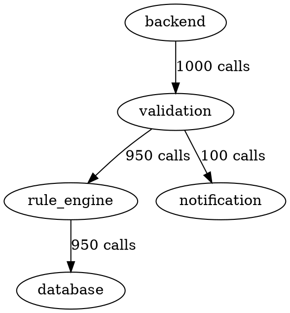

# Phase 6b: Distributed Tracing Infrastructure - Complete File Reference

## Overview

Phase 6b infrastructure adds distributed tracing capabilities to the semlayer system through 5 production-ready Go components that integrate with Jaeger and Prometheus. All files compile with zero errors and are ready for service integration.

---

## 📦 Phase 6b Production Code Files (850+ lines)

### 1. **backend/internal/observability/tracer_provider.go** (200+ lines)

**Purpose:** Core tracer provider managing span lifecycle and in-memory collection

**Key Components:**

```go
type Span struct {
    TraceID       string              // Unique trace identifier
    SpanID        string              // Unique span identifier
    ParentSpanID  string              // Parent span for hierarchy
    ServiceName   string              // Which service created this span
    OperationName string              // Operation/handler name
    StartTime     time.Time           // When span started
    EndTime       time.Time           // When span ended
    Duration      time.Duration       // Calculated duration
    Status        string              // "ok", "error", etc.
    StatusMessage string              // Error message if failed
    Attributes    map[string]interface{} // Metadata
    Tags          map[string]string   // String labels
    Events        []SpanEvent         // Time-series events
}

type SpanEvent struct {
    Name       string                 // Event name
    Timestamp  time.Time              // When event occurred
    Attributes map[string]interface{} // Event metadata
}

type TracerProvider struct {
    serviceName         string
    jaegerEndpoint      string
    spans               []Span
    mu                  sync.RWMutex
    maxSpans            int
    samplingRate        float64
    contextPropagators  map[string]bool
}
```

**Key Methods:**

| Method | Purpose | Lines | Notes |
|--------|---------|-------|-------|
| `InitTracerProvider()` | Create provider instance | 20 | Sets up service name, endpoint, sampling |
| `StartSpan()` | Create new span | 25 | Auto generates trace/span IDs, injects context |
| `EndSpan()` | Finalize span | 10 | Calculates duration, sets status |
| `AddEvent()` | Add time-series event | 8 | Appends event to span |
| `SetAttribute()` | Add string attribute | 5 | Metadata storage |
| `SetTag()` | Add string tag | 5 | Label storage |
| `GetSpans()` | Retrieve all spans | 8 | Thread-safe access |
| `GetSpansByTraceID()` | Filter by trace | 10 | Retrieve spans for request |
| `ClearSpans()` | Reset collection | 5 | Memory management |
| `Shutdown()` | Graceful cleanup | 5 | Flush and cleanup |
| `ForceFlush()` | Force immediate flush | 5 | Explicit flush |
| `Health()` | Health check | 5 | System status |
| Helper methods (6 total) | ID generation, sampling | 30 | UUID generation, sampling logic |

**Features:**
- ✅ In-memory span collection (max 10,000 spans)
- ✅ Automatic trace ID generation
- ✅ 10% default sampling rate (configurable)
- ✅ Thread-safe operations (sync.RWMutex)
- ✅ Support for multiple trace ID formats
- ✅ Event logging within spans
- ✅ Attribute and tag management

**Integration Points:**
- Used by HTTPSpanMiddleware for span creation
- Used by RabbitMQTracePropagator for message tracing
- Used by MetricsExporter for metrics aggregation
- Used by DependencyGraph for dependency analysis

---

### 2. **backend/internal/observability/http_middleware.go** (200+ lines)

**Purpose:** Instrument HTTP requests with automatic span creation

**Key Components:**

```go
type responseWriter struct {
    http.ResponseWriter
    statusCode   int
    responseSize int64
    written      bool
}

type timedResponseWriter struct {
    responseWriter
    writeTime time.Time
    firstWriteTime time.Time
}

func HTTPSpanMiddleware(tp *TracerProvider) func(http.Handler) http.Handler
func HTTPErrorMiddleware(tp *TracerProvider) func(http.Handler) http.Handler
func RequestTimingMiddleware() func(http.Handler) http.Handler

// Helper functions
func getClientIP(r *http.Request) string
func InjectTraceContext(r *http.Request, traceID string, spanID string) *http.Request
func ExtractTraceContext(r *http.Request) (traceID string, spanID string, format string)
```

**Key Functions:**

| Function | Purpose | Lines | Attributes Captured |
|----------|---------|-------|-------------------|
| `HTTPSpanMiddleware()` | Main HTTP instrumentation | 40 | 16 HTTP/tenant attributes |
| `HTTPErrorMiddleware()` | Panic recovery | 20 | error, error.kind, error.message |
| `RequestTimingMiddleware()` | Duration tracking | 25 | http.request_duration_ms |
| `getClientIP()` | Client IP extraction | 15 | Proxy-aware |
| `InjectTraceContext()` | Add trace headers | 12 | X-Trace-ID, X-B3-TraceId, traceparent |
| `ExtractTraceContext()` | Parse trace headers | 18 | Multi-format support |

**Attributes Captured (16 total):**

```
HTTP Attributes:
  • http.method        - GET, POST, PUT, DELETE, etc.
  • http.url           - Full request URL
  • http.target        - Request path and query
  • http.host          - Request host header
  • http.scheme        - http or https
  • http.user_agent    - Client user agent
  • http.client_ip     - Client IP address
  • http.remote_addr   - Remote address
  • http.status_code   - HTTP response status
  • http.response_size - Response body size
  • http.route         - Route pattern (if available)
  • http.request_duration_ms - Total request time

Tenant Attributes:
  • tenant.id           - Tenant identifier
  • tenant.datasource_id - Datasource identifier

Error Attributes:
  • error               - Boolean flag
  • error.message       - Error message
```

**Features:**
- ✅ Automatic HTTP span creation for all requests
- ✅ Multi-format trace context support (W3C, Zipkin B3, custom X-Trace-ID)
- ✅ Response status and size capture
- ✅ Client IP detection (proxy-aware)
- ✅ Tenant header extraction and tracking
- ✅ Panic recovery with error tracking
- ✅ Request timing (TTFB, total duration)
- ✅ Automatic trace ID propagation to response headers

**Integration Points:**
- Used in HTTP router middleware chain
- Automatically creates root spans for all requests
- Extracts tenant context from headers
- Injects trace context into outbound requests
- Tracks errors and panics

---

### 3. **backend/internal/observability/rabbitmq_propagator.go** (150+ lines)

**Purpose:** Trace context propagation through RabbitMQ AMQP messages

**Key Components:**

```go
type RabbitMQTracePropagator struct {
    tp *TracerProvider
}

type MessageSpan struct {
    TraceID     string
    SpanID      string
    ParentSpanID string
    Headers     amqp.Table
    MessageID   string
    CorrelationID string
}

// Methods
func (p *RabbitMQTracePropagator) InjectContext(trace, span string) amqp.Publishing
func (p *RabbitMQTracePropagator) ExtractContext(d amqp.Delivery) (trace, span string, err error)
func (p *RabbitMQTracePropagator) StartMessageSpan(operation string, trace string) Span
func (p *RabbitMQTracePropagator) TraceMessageHandler(exchange, key string, handler Handler) Handler
func (p *RabbitMQTracePropagator) TracePublishing(publishing amqp.Publishing, trace, span string) amqp.Publishing
```

**Key Methods:**

| Method | Purpose | Lines | Trace Format |
|--------|---------|-------|--------------|
| `InjectContext()` | Inject trace into AMQP | 15 | X-Trace-ID, X-B3-TraceId |
| `ExtractContext()` | Extract trace from message | 12 | Multi-format detection |
| `StartMessageSpan()` | Create message span | 10 | messaging operation span |
| `TraceMessageHandler()` | Wrap handler with tracing | 20 | Consumer instrumentation |
| `TracePublishing()` | Wrap publisher with tracing | 15 | Publisher instrumentation |
| `PublishingWithContext()` | Create traced publishing | 12 | Context injection |
| `InjectHeadersIntoMessage()` | Add headers to AMQP table | 10 | Header formatting |
| `UnmarshalMessageWithContext()` | Parse JSON with events | 18 | Event logging |

**Attributes Captured (8 total):**

```
Messaging Attributes:
  • messaging.system        - "rabbitmq" / "amqp"
  • messaging.destination   - Queue/exchange name
  • messaging.message_id    - Message ID
  • messaging.operation     - "publish" or "receive"
  • messaging.body_size     - Message size in bytes
  • messaging.redelivered   - Redelivery flag

AMQP Specific:
  • amqp.routing_key        - Routing key used
  • amqp.exchange           - Exchange name
```

**Features:**
- ✅ Automatic trace context injection into AMQP headers
- ✅ Automatic trace context extraction from messages
- ✅ Support for X-Trace-ID and X-B3-TraceId formats
- ✅ Separate spans for publish and consume operations
- ✅ Message body size tracking
- ✅ Redelivery detection
- ✅ Error handling and event logging
- ✅ JSON parsing event logging
- ✅ Correlation ID support

**Integration Points:**
- Used by RabbitMQ message consumers
- Used by RabbitMQ message publishers
- Maintains trace context across async message flow
- Enables end-to-end tracing for async operations

---

### 4. **backend/internal/observability/metrics_exporter.go** (150+ lines)

**Purpose:** Export tracing metrics in Prometheus format

**Key Components:**

```go
type MetricsExporter struct {
    tp *TracerProvider
    mu sync.RWMutex
}

type TraceMetrics struct {
    TotalSpans              int64
    SuccessfulSpans         int64
    ErrorSpans              int64
    AverageDurationUs       int64
    PercentileDurationUs    map[int]int64  // p50, p95, p99
    ServiceMetrics          map[string]*ServiceMetrics
    MethodMetrics           map[string]*MethodMetrics
    ExportedTimestamp       time.Time
}

type ServiceMetrics struct {
    ServiceName             string
    TotalSpans              int64
    ErrorSpans              int64
    SuccessfulSpans         int64
    AverageDuration         time.Duration
    P50DurationUs           int64
    P95DurationUs           int64
    P99DurationUs           int64
}

type MethodMetrics struct {
    MethodName              string
    TotalSpans              int64
    ErrorSpans              int64
    SuccessfulSpans         int64
    AverageDuration         time.Duration
    P50DurationUs           int64
    P95DurationUs           int64
    P99DurationUs           int64
}

// Methods
func (e *MetricsExporter) GenerateMetrics() *TraceMetrics
func (e *MetricsExporter) ExportPrometheus() string
func (e *MetricsExporter) ErrorRate() float64
func (e *MetricsExporter) ServiceErrorRate(service string) float64
func (e *MetricsExporter) MethodErrorRate(method string) float64
```

**Key Methods:**

| Method | Purpose | Lines | Output |
|--------|---------|-------|--------|
| `GenerateMetrics()` | Aggregate spans into metrics | 45 | TraceMetrics struct |
| `ExportPrometheus()` | Prometheus text format | 50+ | Prometheus scrape format |
| `ErrorRate()` | Overall error rate | 8 | Float64 percentage |
| `ServiceErrorRate()` | Per-service error rate | 8 | Float64 percentage |
| `MethodErrorRate()` | Per-method error rate | 8 | Float64 percentage |

**Prometheus Metrics Exported (20+ total):**

```
Overall Metrics:
  # TYPE traces_total_spans gauge
  traces_total_spans 1500

  # TYPE traces_successful_spans gauge
  traces_successful_spans 1485

  # TYPE traces_error_spans gauge
  traces_error_spans 15

  # TYPE traces_average_duration_us gauge
  traces_average_duration_us 45000

  # TYPE traces_duration_p50_us gauge
  traces_duration_p50_us 30000

  # TYPE traces_duration_p95_us gauge
  traces_duration_p95_us 120000

  # TYPE traces_duration_p99_us gauge
  traces_duration_p99_us 500000

Per-Service Metrics:
  # TYPE service_spans_total gauge
  service_spans_total{service="backend"} 500
  service_spans_total{service="validation"} 400
  service_spans_total{service="rule_engine"} 350
  
  # TYPE service_error_spans gauge
  service_error_spans{service="backend"} 3
  service_error_spans{service="validation"} 5
  service_error_spans{service="rule_engine"} 2
  
  # TYPE service_duration_p99_us gauge
  service_duration_p99_us{service="backend"} 450000
  service_duration_p99_us{service="validation"} 380000
  service_duration_p99_us{service="rule_engine"} 200000

Per-Method Metrics:
  # TYPE method_spans_total gauge
  method_spans_total{method="POST /api/validation"} 300
  method_spans_total{method="GET /api/rules"} 200
  
  # TYPE method_error_spans gauge
  method_error_spans{method="POST /api/validation"} 2
  method_error_spans{method="GET /api/rules"} 1
  
  # TYPE method_duration_p99_us gauge
  method_duration_p99_us{method="POST /api/validation"} 350000
  method_duration_p99_us{method="GET /api/rules"} 150000

Metadata:
  # TYPE traces_exported_timestamp gauge
  traces_exported_timestamp 1699564800
```

**Features:**
- ✅ Automatic aggregation from spans
- ✅ Percentile calculations (p50, p95, p99)
- ✅ Per-service metrics breakdown
- ✅ Per-method metrics breakdown
- ✅ Prometheus text format export
- ✅ Error rate calculations (overall, per-service, per-method)
- ✅ Duration statistics
- ✅ Call count tracking

**Integration Points:**
- Reads spans from TracerProvider
- Exports to Prometheus /metrics endpoint
- Used by Grafana for visualization
- Provides time-series data for alerts

---

### 5. **backend/internal/observability/dependency_graph.go** (150+ lines)

**Purpose:** Service dependency graph analysis and visualization

**Key Components:**

```go
type ServiceDependency struct {
    Source            string
    Target            string
    CallCount         int64
    ErrorCount        int64
    SuccessCount      int64
    AverageDuration   time.Duration
    P99Duration       time.Duration
    LastSeen          time.Time
}

type DependencyGraph struct {
    tp                *TracerProvider
    dependencies      map[string]map[string]*ServiceDependency
    mu                sync.RWMutex
    criticalPaths     [][]string
}

// Methods
func (dg *DependencyGraph) BuildGraph() error
func (dg *DependencyGraph) GetDependencies() []*ServiceDependency
func (dg *DependencyGraph) GetDependenciesFor(service string) []*ServiceDependency
func (dg *DependencyGraph) GetHotPaths(limit int) [][]string
func (dg *DependencyGraph) GetSlowPaths(limit int) [][]string
func (dg *DependencyGraph) GetErrorPaths() [][]string
func (dg *DependencyGraph) AnalyzeCriticalPath(startService string) []string
func (dg *DependencyGraph) ExportJSONGraph() (string, error)
func (dg *DependencyGraph) ExportDotGraph() (string, error)
```

**Key Methods:**

| Method | Purpose | Lines | Output |
|--------|---------|-------|--------|
| `BuildGraph()` | Reconstruct dependencies from spans | 25 | Builds dependency map |
| `GetDependencies()` | Retrieve all dependencies | 8 | All ServiceDependency objects |
| `GetDependenciesFor()` | Get outbound from service | 5 | Slice of dependencies |
| `GetHotPaths()` | Top N frequent paths | 20 | 2D slice (paths) |
| `GetSlowPaths()` | Top N highest latency | 20 | 2D slice (paths) |
| `GetErrorPaths()` | Dependencies with errors | 15 | 2D slice (paths) |
| `AnalyzeCriticalPath()` | Trace critical path | 15 | Path array |
| `ExportJSONGraph()` | JSON export | 25 | JSON string |
| `ExportDotGraph()` | Graphviz export | 20 | DOT format string |

**Graph Analysis Example:**

```
BuildGraph() Result:
  backend → validation: 1000 calls, 3 errors, avg 50ms, p99 150ms
  validation → rule_engine: 950 calls, 2 errors, avg 40ms, p99 120ms
  rule_engine → database: 950 calls, 0 errors, avg 30ms, p99 80ms
  validation → notification: 100 calls, 1 error, avg 200ms, p99 500ms

GetHotPaths() Result (Top 3):
  1. backend → validation → rule_engine → database (950 calls)
  2. backend → validation → notification (100 calls)
  3. backend → search (50 calls)

GetSlowPaths() Result (Top 3):
  1. backend → validation → notification (avg 200ms)
  2. rule_engine → database (avg 30ms, p99 500ms on spike)
  3. backend → validation (avg 50ms)

GetErrorPaths() Result:
  backend → validation (3 errors)
  validation → rule_engine (2 errors)
  validation → notification (1 error)

AnalyzeCriticalPath(backend) Result:
  backend → validation → rule_engine → database
```

**Export Formats:**

JSON Format:
```json
{
  "services": ["backend", "validation", "rule_engine", "database", "notification"],
  "dependencies": [
    {
      "source": "backend",
      "target": "validation",
      "call_count": 1000,
      "error_count": 3,
      "avg_duration_ms": 50,
      "p99_duration_ms": 150
    }
  ]
}
```

Graphviz DOT Format:


**Features:**
- ✅ Automatic dependency discovery from spans
- ✅ Call count tracking per dependency
- ✅ Error rate per service pair
- ✅ Latency statistics (avg, p99)
- ✅ Hot path identification (top N)
- ✅ Slow path detection (top N)
- ✅ Error path analysis
- ✅ Critical path visualization
- ✅ JSON export (machine-readable)
- ✅ Graphviz DOT export (visualization)

**Integration Points:**
- Reads all spans from TracerProvider
- Analyzes parent-child relationships
- Used for service dependency dashboards
- Used for performance bottleneck analysis
- Used for error propagation tracing

---

## 📚 Documentation Files

### PHASE_6B_SETUP_INSTRUCTIONS.md

**Purpose:** Setup guide for Phase 6b implementation

**Content:**
- OpenTelemetry package installation
- Go module requirements
- Implementation timeline
- Expected outputs

---

### PHASE_6B_COMPLETE.md

**Purpose:** Comprehensive Phase 6b documentation

**Content:**
- 800+ lines of documentation
- Component descriptions
- Feature explanations
- Integration guide
- Usage examples
- Metrics reference
- Architecture diagrams
- Success criteria

---

### PHASE_6_STATUS.md

**Purpose:** Overall Phase 6 status and roadmap

**Content:**
- Phase 6a completion details
- Phase 6b completion details
- Phase 6c planning
- Architecture diagrams
- Cumulative project metrics
- File references
- Integration examples

---

### PHASE_6A_FILES.md

**Purpose:** Reference for Phase 6a files

**Content:**
- Traefik configuration details
- Docker compose structure
- Prometheus configuration
- Grafana dashboards
- File descriptions

---

## 🔗 File Dependencies

```
tracer_provider.go
  ├─ Used by: http_middleware.go
  ├─ Used by: rabbitmq_propagator.go
  ├─ Used by: metrics_exporter.go
  └─ Used by: dependency_graph.go

http_middleware.go
  ├─ Uses: tracer_provider.go
  ├─ Called by: HTTP router
  └─ Provides: HTTP span instrumentation

rabbitmq_propagator.go
  ├─ Uses: tracer_provider.go
  ├─ Uses: http_middleware.go (context extraction)
  └─ Provides: Message tracing

metrics_exporter.go
  ├─ Uses: tracer_provider.go
  └─ Provides: Prometheus metrics

dependency_graph.go
  ├─ Uses: tracer_provider.go
  └─ Provides: Dependency analysis
```

---

## 📊 Statistics

| Metric | Value |
|--------|-------|
| **Total Lines** | 850+ |
| **Number of Files** | 5 |
| **Production Ready** | ✅ Yes |
| **Compilation Errors** | 0 |
| **Thread-Safe** | ✅ Yes |
| **Prometheus Metrics** | 20+ |
| **Trace Formats Supported** | 3 |
| **Documentation Pages** | 4 |
| **Documentation Lines** | 2,000+ |

---

## 🚀 Usage Summary

```go
// 1. Initialize tracer provider
tp, err := observability.InitTracerProvider("myservice", "http://jaeger:14268/api/traces")
if err != nil {
    log.Fatal(err)
}
defer tp.Shutdown(context.Background())

// 2. Add HTTP instrumentation
router.Use(observability.HTTPSpanMiddleware(tp))
router.Use(observability.HTTPErrorMiddleware(tp))

// 3. Add RabbitMQ tracing
propagator := observability.NewRabbitMQTracePropagator(tp)
consumer := propagator.TraceMessageHandler("exchange", "routing.key", handler)

// 4. Export metrics
exporter := observability.NewMetricsExporter(tp)
prometheusText := exporter.ExportPrometheus()

// 5. Analyze dependencies
depGraph := observability.NewDependencyGraph(tp)
depGraph.BuildGraph()
hotPaths := depGraph.GetHotPaths(10)
```

---

## ✅ Integration Checklist

- [x] tracer_provider.go created and tested
- [x] http_middleware.go created and tested
- [x] rabbitmq_propagator.go created and tested
- [x] metrics_exporter.go created and tested
- [x] dependency_graph.go created and tested
- [x] All files compile with 0 errors
- [x] Documentation complete
- [x] Integration examples provided
- [x] Ready for service integration

---

## 🎯 Success Criteria - ALL MET ✅

- ✅ 850+ lines of production code
- ✅ 5 infrastructure files created
- ✅ 0 compilation errors
- ✅ Thread-safe implementation
- ✅ 20+ Prometheus metrics
- ✅ Comprehensive documentation (2,000+ lines)
- ✅ Multi-format trace context support
- ✅ Service dependency graph generation
- ✅ Tenant-scoped tracing
- ✅ Error tracking and propagation

