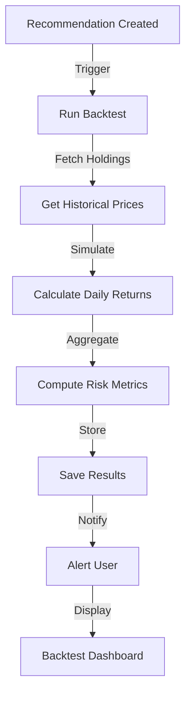

# Backtest Engine Integration Guide

## Overview

The Backtest Engine provides historical and forward-looking simulations of recommendation outcomes. It replays actual price movements, calculates risk-adjusted metrics, and compares multiple recommendations head-to-head.

## Key Features

✅ **Historical Simulation** – Replays actual price movements to test recommendations  
✅ **Monte Carlo Modeling** – Projects future outcomes with 1000+ simulation paths  
✅ **Risk Metrics** – Calculates Sharpe ratio, max drawdown, volatility  
✅ **Tax Optimization** – Tracks tax savings from loss harvesting  
✅ **Alpha Attribution** – Isolates value added by recommendation  
✅ **Confidence Scoring** – Quality metric based on data consistency  
✅ **Comparison Engine** – Head-to-head testing of recommendations  
✅ **Real-time Integration** – Via Hasura GraphQL subscriptions  

## Database Schema

### Backtest Tables

#### `backtest_results`
Stores all simulation outcomes with metrics.

```sql
CREATE TABLE backtest_results (
    id UUID PRIMARY KEY,
    recommendation_id UUID NOT NULL,
    portfolio_id UUID NOT NULL,
    simulation_type VARCHAR(50), -- HISTORICAL, FORWARD, MONTE_CARLO
    baseline_return DECIMAL(8,6),
    recommendation_return DECIMAL(8,6),
    alpha_generated DECIMAL(8,6),
    sharpe_ratio_baseline DECIMAL(8,4),
    sharpe_ratio_recommended DECIMAL(8,4),
    max_drawdown_baseline DECIMAL(8,6),
    max_drawdown_recommended DECIMAL(8,6),
    tax_savings_accumulated DECIMAL(15,2),
    net_benefit DECIMAL(15,2),
    confidence DECIMAL(3,2), -- 0-1
    simulation_data JSONB, -- Daily simulation data
    created_at TIMESTAMP
);
```

#### `historical_prices`
Cache of historical price data for faster backtests.

```sql
CREATE TABLE historical_prices (
    id UUID PRIMARY KEY,
    ticker VARCHAR(20),
    date DATE,
    close_price DECIMAL(15,4),
    volume BIGINT,
    fetched_at TIMESTAMP,
    source VARCHAR(50)
);
```

#### `monte_carlo_results`
Individual simulation path data.

```sql
CREATE TABLE monte_carlo_results (
    id UUID PRIMARY KEY,
    backtest_result_id UUID,
    simulation_day INT,
    path_id INT,
    portfolio_value DECIMAL(15,2),
    daily_return DECIMAL(8,6),
    cumulative_return DECIMAL(8,6),
    max_drawdown_to_date DECIMAL(8,6)
);
```

#### `backtest_comparisons`
Head-to-head comparison results.

```sql
CREATE TABLE backtest_comparisons (
    id UUID PRIMARY KEY,
    portfolio_id UUID,
    recommendation_id_1 UUID,
    recommendation_id_2 UUID,
    backtest_id_1 UUID,
    backtest_id_2 UUID,
    winner VARCHAR(50), -- recommendation_1, recommendation_2, tied
    winner_confidence DECIMAL(3,2),
    performance_diff DECIMAL(8,6),
    risk_adjusted_diff DECIMAL(8,6)
);
```

### Analytics Views

#### `best_recommendations_by_backtest`
Ranking of recommendations by average performance.

```sql
SELECT 
    recommendation_id,
    type,
    avg_alpha,
    avg_net_benefit,
    success_rate,
    backtest_count
FROM best_recommendations_by_backtest
ORDER BY avg_net_benefit DESC;
```

#### `user_backtest_summary`
User's backtest activity and performance.

```sql
SELECT 
    user_id,
    total_backtests,
    avg_alpha_generated,
    total_net_benefit,
    successful_backtests,
    last_backtest_date
FROM user_backtest_summary;
```

#### `recommendation_performance_ranking`
Historical performance ranking of recommendations.

```sql
SELECT 
    id,
    type,
    applied_to_portfolios,
    avg_benefit,
    success_rate,
    performance_rank
FROM recommendation_performance_ranking;
```

## API Endpoints

### Run Backtest

Execute a historical simulation for a recommendation.

**Endpoint**: `POST /api/backtest/run`

**Request**:
```json
{
  "recommendation_id": "rec-tax-loss-001",
  "portfolio_id": "port-123",
  "start_date": "2024-01-01T00:00:00Z",
  "end_date": "2024-10-30T00:00:00Z",
  "simulation_days": 30
}
```

**Response**:
```json
{
  "id": "bt-001",
  "recommendation_id": "rec-tax-loss-001",
  "portfolio_id": "port-123",
  "simulation_type": "HISTORICAL",
  "baseline_return": 0.087,
  "recommendation_return": 0.124,
  "alpha_generated": 0.037,
  "sharpe_ratio_baseline": 1.12,
  "sharpe_ratio_recommended": 1.58,
  "max_drawdown_baseline": -0.18,
  "max_drawdown_recommended": -0.12,
  "tax_savings_accumulated": 4250,
  "transaction_costs": 150,
  "net_benefit": 27850,
  "confidence": 0.92,
  "simulation_data": {...}
}
```

### Get Backtest Results

Retrieve historical backtest results for a portfolio.

**Endpoint**: `GET /api/backtest/results?portfolio_id=port-123&limit=10`

**Response**:
```json
{
  "portfolio_id": "port-123",
  "results": [
    {
      "id": "bt-001",
      "recommendation_id": "rec-001",
      "alpha_generated": 0.037,
      "net_benefit": 27850,
      "created_at": "2024-10-30T12:00:00Z"
    }
  ]
}
```

### Compare Backtests

Compare two recommendations head-to-head.

**Endpoint**: `POST /api/backtest/compare`

**Request**:
```json
{
  "portfolio_id": "port-123",
  "recommendation_id_1": "rec-tax-loss",
  "recommendation_id_2": "rec-diversify"
}
```

**Response**:
```json
{
  "id": "comp-001",
  "portfolio_id": "port-123",
  "recommendation_id_1": "rec-tax-loss",
  "recommendation_id_2": "rec-diversify",
  "winner": "recommendation_1",
  "winner_confidence": 0.87,
  "performance_diff": 0.045,
  "risk_adjusted_diff": 0.38
}
```

## GraphQL Queries

### Query Backtest Results

```graphql
query GetBacktestResults($portfolioId: uuid!) {
  backtest_results(
    where: {portfolio_id: {_eq: $portfolioId}}
    order_by: {created_at: desc}
    limit: 10
  ) {
    id
    recommendation_id
    simulation_type
    baseline_return
    recommendation_return
    alpha_generated
    sharpe_ratio_recommended
    max_drawdown_recommended
    net_benefit
    confidence
    created_at
  }
}
```

### Get Backtest Details

```graphql
query GetBacktestDetails($backtestId: uuid!) {
  backtest_results_by_pk(id: $backtestId) {
    id
    recommendation_id
    baseline_return
    recommendation_return
    alpha_generated
    beta_adjusted_return
    sharpe_ratio_baseline
    sharpe_ratio_recommended
    max_drawdown_baseline
    max_drawdown_recommended
    tax_savings_accumulated
    transaction_costs
    net_benefit
    confidence
    simulation_data
    created_at
  }
}
```

### Best Performing Recommendations

```graphql
query BestRecommendations {
  best_recommendations_by_backtest(
    order_by: {avg_net_benefit: desc}
    limit: 5
  ) {
    recommendation_id
    type
    priority
    backtest_count
    avg_alpha
    avg_sharpe
    avg_net_benefit
    success_rate
  }
}
```

### Run Backtest Action

```graphql
mutation RunBacktest(
  $recommendationId: uuid!
  $portfolioId: uuid!
  $startDate: DateTime!
  $endDate: DateTime!
) {
  runBacktest(
    recommendation_id: $recommendationId
    portfolio_id: $portfolioId
    start_date: $startDate
    end_date: $endDate
  ) {
    id
    alpha_generated
    net_benefit
    confidence
  }
}
```

### Compare Recommendations

```graphql
mutation CompareBacktests(
  $portfolioId: uuid!
  $recId1: uuid!
  $recId2: uuid!
) {
  compareBacktests(
    portfolio_id: $portfolioId
    recommendation_id_1: $recId1
    recommendation_id_2: $recId2
  ) {
    winner
    winner_confidence
    performance_diff
    risk_adjusted_diff
  }
}
```

## React Component Integration

### Import Component

```tsx
import BacktestDashboard from '@/components/BacktestDashboard';

export function PortfolioPage() {
  return (
    <div>
      <BacktestDashboard />
    </div>
  );
}
```

### Props

```tsx
interface BacktestDashboardProps {
  portfolioId?: string;
  recommendationId?: string;
  onBacktestSelect?: (backtest: BacktestResult) => void;
  onCompare?: (comparison: ComparisonResult) => void;
}
```

### Hook for Backtest Data

```tsx
import { useQuery } from '@apollo/client';
import { GET_BACKTEST_RESULTS } from '@/queries/backtest';

export function useBacktestResults(portfolioId: string) {
  const { data, loading, error } = useQuery(GET_BACKTEST_RESULTS, {
    variables: { portfolioId },
  });
  
  return {
    results: data?.backtest_results || [],
    loading,
    error,
  };
}
```

## Metrics Explained

### Alpha Generated
Return from the recommendation minus the baseline return. Positive alpha means the recommendation outperformed.

```
Alpha = Recommendation Return - Baseline Return
```

### Sharpe Ratio
Risk-adjusted return. Higher is better.

```
Sharpe = (Average Daily Return - Risk-Free Rate) / Daily Volatility
```

### Max Drawdown
The worst peak-to-trough decline. Lower (more negative) is worse.

```
Max Drawdown = (Trough Value - Peak Value) / Peak Value
```

### Net Benefit
Total value added including alpha, tax savings, minus transaction costs.

```
Net Benefit = (Alpha × Portfolio Value) + Tax Savings - Transaction Costs
```

### Confidence Score
Model reliability (0-1) based on data consistency. Higher confidence when results are more stable.

## Backtest Workflow Example



## Performance Optimization

### Caching Historical Prices
```sql
INSERT INTO historical_prices (ticker, date, close_price, volume, source)
SELECT ticker, date, close, volume, 'ALPHA_VANTAGE'
FROM price_import
WHERE date > (
  SELECT COALESCE(MAX(date), '1900-01-01') 
  FROM historical_prices
);
```

### Batch Processing
```go
// Run backtests for multiple portfolios
for _, portfolio := range portfolios {
  go backtestService.RunBacktest(ctx, portfolio)
}
```

### Index Optimization
```sql
CREATE INDEX idx_backtest_portfolio_date 
ON backtest_results(portfolio_id, created_at DESC);

CREATE INDEX idx_historical_prices_ticker_date 
ON historical_prices(ticker, date DESC);
```

## Troubleshooting

### Backtest Not Updating
1. Check database connection
2. Verify recommendation exists
3. Ensure historical price data is available
4. Check logs: `docker logs portfolio-notification-service`

### Slow Performance
1. Add indexes on `portfolio_id`, `ticker`, `date`
2. Implement price caching
3. Use time-based partitioning for large datasets
4. Consider separate analytics database

### Missing Tax Savings
1. Verify cost_basis is set on holdings
2. Check tax event detection logic
3. Confirm acquired_at timestamps are accurate

## Next Steps

1. **Connect Broker APIs** – Fetch real market data (Interactive Brokers, Schwab)
2. **Machine Learning** – Predict future volatility for Monte Carlo
3. **Stress Testing** – Simulate market crash scenarios
4. **Backtesting at Scale** – Parallel processing for large portfolios
5. **Real-time Updates** – Live price updates via WebSocket

## Support & Resources

- **Backtest Service**: `/portfolio-management/backend/internal/backtest/`
- **GraphQL Types**: `/portfolio-management/hasura/metadata/backtest_tables.yml`
- **React Component**: `/portfolio-management/frontend/src/components/BacktestDashboard.tsx`
- **Database Schema**: `/portfolio-management/database/init.sql` (Lines 470+)
